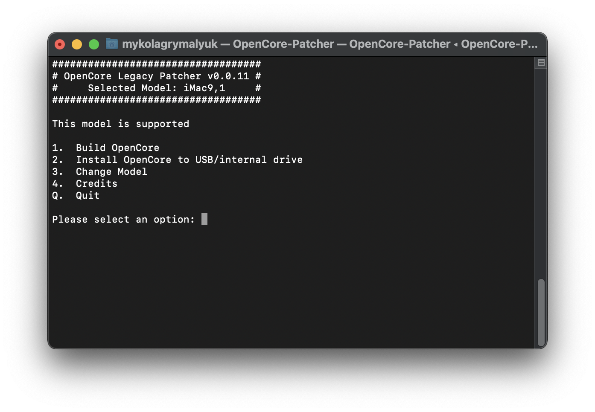
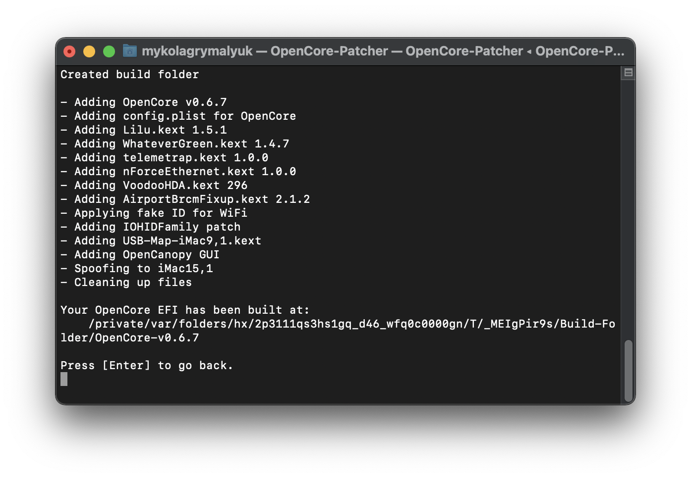

# OpenCore Legacy Patcher

A python script for building and booting OpenCore on legacy Macs, see [Supported SMBIOS](/docs/MODELS.md) on whether your model is supported.

Supported features:

* System Integrity Protection, FileVault 2 and .im4m Secure Boot
* Native OTA OS updates
* Recovery OS, Safe Mode and Single-user Mode booting
* Zero firmware patching required(ie. APFS ROM patching)
* GPU Switching on MacBook Pro models(2012 and newer)

Note: Only clean-installs and upgrades are supported, installs already patched with [Patched-Sur](https://github.com/BenSova/Patched-Sur) or [bigmac](https://github.com/StarPlayrX/bigmac) cannot be used due to broken file integrity with APFS snapshots and SIP.

* You can however reinstall macOS with this patcher and retain your original data

## How to use

To use, simply:

1. Ensure your hardware is compatible(See [Supported SMBIOS](/docs/MODELS.md))
2. Download and build macOS Installer
3. Download the latest release: [OpenCore Legacy Patcher Releases](https://github.com/dortania/Opencore-Legacy-Patcher/releases)
4. Run the `OpenCore-Patcher` binary
5. Run `Build OpenCore`(if building for another machine, please select `Change Model`)

| First Run | Build EFI |
| :--- | :--- |
|  |  |

  * Note: When the patcher ask you to if you want to use original serials, we recommend doing so. To determine yourself if you want:
    * Original: Mac is nearly identical to pre-patcher, with only minor changes in SMBIOS. Ideal configuration for iServices to work correctly
	* Custom: Rebuilds SMBIOS table to Mac you're spoofing, generally recommended when troubleshooting such as APFS support missing in the installer

6. Run `Install OpenCore to USB/internal drive`

| Select Drive | Select EFI/FAT32 Partition |
| :--- | :--- |
|  |  |

  * Ensure you install OpenCore onto a FAT32 partition to ensure your Mac is able to boot it, you may need to format your drive as GUID/GPT in Disk Utility
  
7. Reboot machine while holding `Option` to select OpenCore, then boot the macOS Installer

| Mac Boot Picker | OpenCore Picker |
| :--- | :--- |
|  |  |

For nightly builds, you can either run `OpenCore-Patcher.command` from [main](https://github.com/dortania/Opencore-Legacy-Patcher/archive/main.zip) or grab the binary from  [Github Actions](https://github.com/dortania/Opencore-Legacy-Patcher/actions). Note the latter does not require a py3 install.

## How to uninstall OpenCore?

To remove OpenCore is actually quite simply:

1. Remove OpenCore either from the USB or internal drive
  * You'll need to mount the drive's EFI partition, and delete the EFI folder
  * [See here for example how to mount](https://dortania.github.io/OpenCore-Post-Install/universal/oc2hdd.html)
2. Reset NVRAM
  * [Reset NVRAM or PRAM on your Mac](https://support.apple.com/HT204063)
  
Know that if you are on Big Sur when you remove the EFI folder, your Mac will no longer boot and show the prohibited symbol. Be ready to install an older version of macOS before you uninstall Open Core.

## [Troubleshooting](/docs/TROUBLESHOOTING.md)
