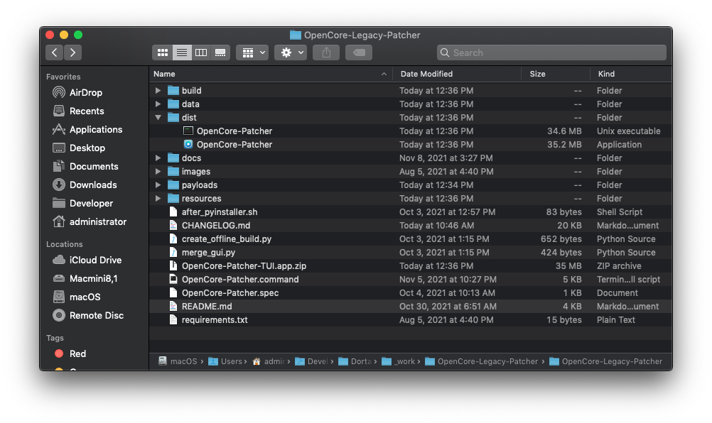

# Build and run from source

OpenCore Legacy Patcher at its core is a python-based TUI/CLI based application. This means that to run the project from source, you simply need to invoke the OpenCore-Patcher.command file via Python.

For developers wishing to validate mainline changes, you may use these nightly links:

* [GUI (Graphical Based App)](https://nightly.link/dortania/OpenCore-Legacy-Patcher/workflows/build-app-wxpython/main/OpenCore-Patcher.app%20%28GUI%29.zip)
* [TUI (Text Based App)](https://nightly.link/dortania/OpenCore-Legacy-Patcher/workflows/build-app/main/OpenCore-Patcher-TUI.app.zip)

**Warning**: These binaries should not be used without first consulting the [CHANGELOG](./CHANGELOG.md). Do not distribute these links in forums, instead direct to this file.

* Users running new builds of the project without understanding what has changed are at higher of bricking their installation as they do not read any warnings provided in the CHANGELOG. We wish to minimize these situations as much as possible.

## Getting Started

To start, ensure you have python 3.6 or newer installed. Additionally ensure that they were downloaded from the Official source, [python.org](https://www.python.org/downloads/macos/).

* Python installations either preinstalled or provided with Xcode/Xcode Tools are unsupported due to reliablility issues

Once Python is installed, open Terminal and run the following:

```sh
# Move into a directory to store the project
cd ~/Developer
# Clone project
git clone https://github.com/dortania/OpenCore-Legacy-Patcher
# Move into Project directory
cd ./OpenCore-Legacy-Patcher
# Install Python dependencies used by the project
pip3 install -r requirements.txt
```

If you have installation error, see following troubleshooting options:

* Use Python 3.9
  * Currently our build server uses py3.9 for generating binaries used in releases
* Use .whl snapshots for installing additional dependencies
  * [wxPython 4.1.1 wheel for py3.9](https://files.pythonhosted.org/packages/2c/a8/7027e8ca3ba20dc2ed2acd556e31941cb44097ab87d6f81d646a79de4eab/wxPython-4.1.1-cp39-cp39-macosx_10_10_x86_64.whl)
  * [PyObjc 8.5 wheel for py3](https://files.pythonhosted.org/packages/69/3d/786f379dd669a078cf0c4a686e242c9b643071c23367bfbd3d9a7eb589ec/pyobjc-8.5-py3-none-any.whl)
  * [Requests 2.27.1 for py2/py3](https://files.pythonhosted.org/packages/2d/61/08076519c80041bc0ffa1a8af0cbd3bf3e2b62af10435d269a9d0f40564d/requests-2.27.1-py2.py3-none-any.whl)
  * [pyinstaller 5.3 for py3](https://files.pythonhosted.org/packages/65/70/625e86e5a45cb975a9c32a10a721394d10771275c69207308b80bc6a758e/pyinstaller-5.3-py3-none-macosx_10_13_universal2.whl)


## Running OpenCore Legacy Patcher

To run the project from source, simply invoke via python3:

```sh
# Launch TUI
python3 OpenCore-Patcher.command
```

```sh
# Launch GUI
python3 OpenCore-Patcher-GUI.command
```

Note that the OpenCore-Patcher.command file can be run as both a TUI and a CLI utility for other programs to call. If no core arguments are passed, the TUI is initialized. Otherwise the CLI will start:

```sh
# Launch CLI
python3 OpenCore-Patcher.command --build --model iMac12,2 --verbose
```

See `-h`/`--help` for more information on supported CLI arguments.

## Generating prebuilt binaries

The main goal of generating prebuilt binaries is to strip the requirement of a local python installation for users. For developers, there's very little benefit besides enabling dark mode support in the GUI. For development, simply use the OpenCore-Patcher.command file with a python3 installation.

* Note that due to PyInstaller's linking mechanism, binaries generated on Catalina and newer are not compatible with High Sierra and older
  * To ensure the largest compatibility, generate binaries on macOS Mojave. These binaries will be compatible with macOS 10.9 to macOS 12.
  * Currently our build system is a [Macmini8,1 provided by MacStadium](https://www.macstadium.com/opensource) running macOS Mojave (10.14.6).

```sh
# Install PyInstaller
pip3 install pyinstaller
# Move into project directory
cd ~/Developer/OpenCore-Legacy-Patcher/
# Create the pyinstaller based Application
# Optional Arguments
#    '--build_tui':          Create TUI vairant
#    '--reset_binaries':     Redownload and generate support files
python3 Build-Binary.command
# Open build folder
open ./dist/
```

Once done, you'll find the application generated at `./dist/OpenCore-Patcher.app`:


