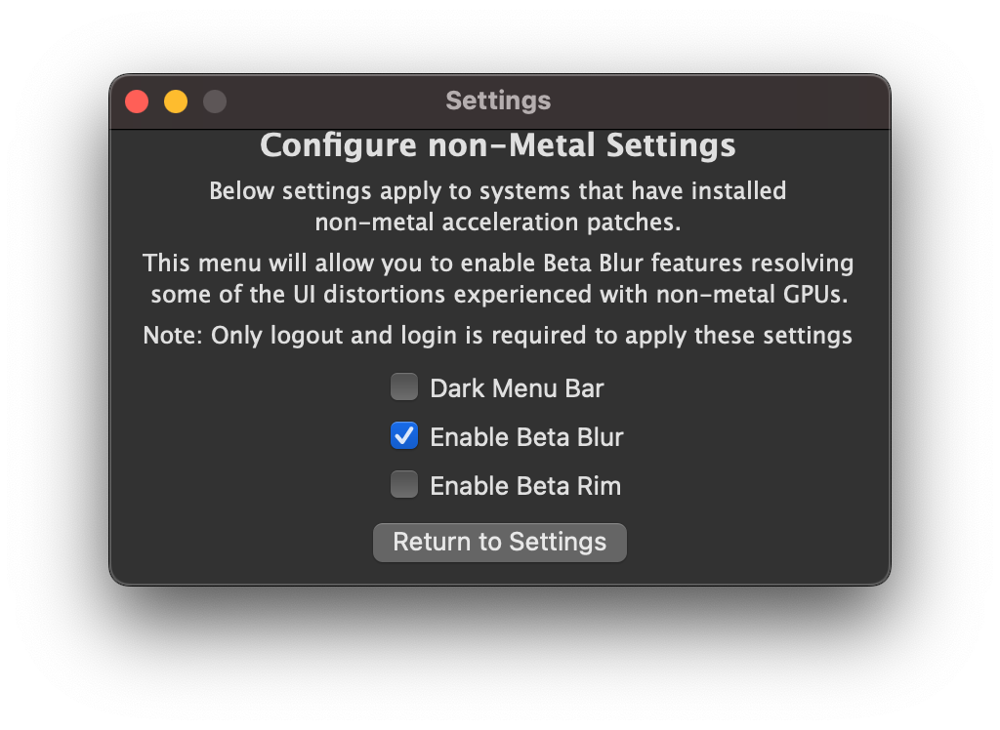
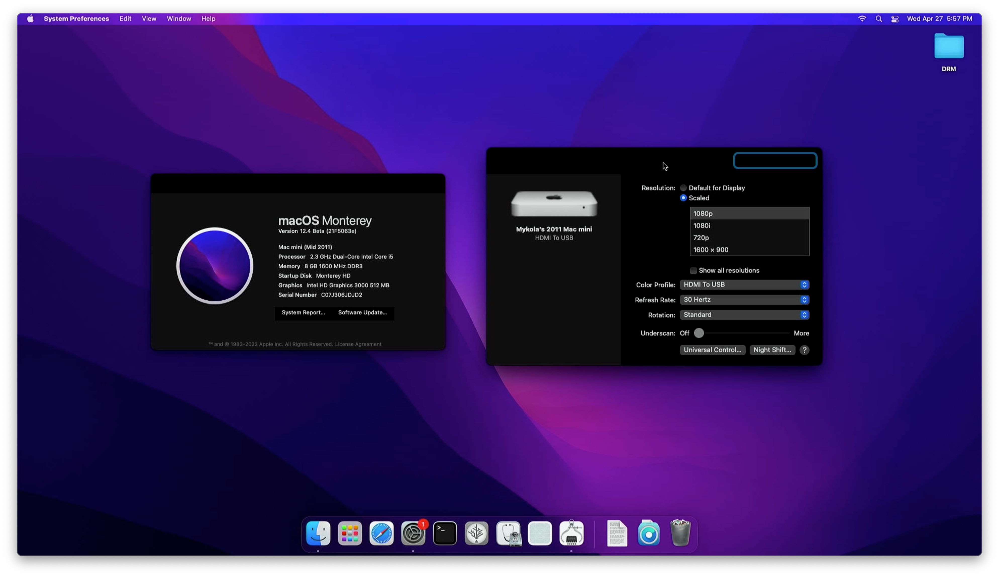
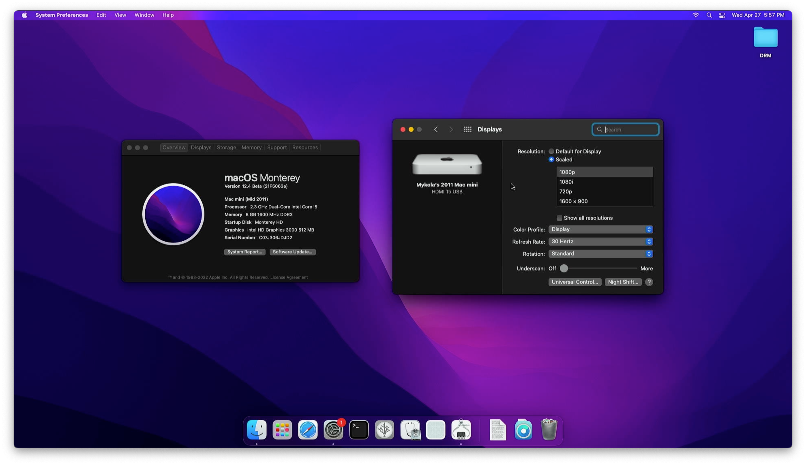

# Working around non-Metal Acceleration Issues

The following page is for users experiencing issues with their overall usage of the non-Metal Acceleration patches, included with OpenCore Legacy Patcher 0.1.1 and later. For those unfamiliar with what is considered a non-Metal GPU, see the chart below:

::: details macOS GPU Chart

Metal is Apple's in-house graphics API that acts as a replacement for OpenGL/OpenCL, introduced in 2015. With the release of macOS Mojave, every system without a Metal-capable GPU was dropped.  

| Graphics Vendor | Architecture | Series | Supports Metal |
| :--- | :--- | :--- | :--- |
| ATI | TeraScale 1 | HD2000 - HD4000 | <span style="color:red">No</span> |
| ^^ | TeraScale 2 | HD5000 - HD6000 | ^^ |
| AMD | GCN (and later) | HD7000+ | <span style="color:green">Yes</span> |
| NVIDIA | Tesla | 8000GT - GT300 |  <span style="color:red">No</span> |
| ^^ | Fermi | GT400 - GT500 | ^^ |
| ^^ | Kepler | GT600 - GT700 | <span style="color:green">Yes</span> |
| Intel | GMA | GMA900 - GMA3000 | <span style="color:red">No</span> |
| ^^ | Iron Lake | HD series | ^^ |
| ^^ | Sandy Bridge | HD3000 | ^^ |
| ^^ | Ivy Bridge (and later) | HD4000 | <span style="color:green">Yes</span> |

::: warning
OpenCore Legacy patcher does not have acceleration patches for Intel's GMA architecture.
:::

* [Broken Background Blurs](#broken-background-blurs)
* [Downloading older non-Metal Apps](#downloading-older-non-metal-apps)
* [Unable to run Zoom](#unable-to-run-zoom)
* [Unable to grant special permissions to apps (ie. Camera Access to Zoom)](#unable-to-grant-special-permissions-to-apps-ie-camera-access-to-zoom)
* [Keyboard Backlight broken](#keyboard-backlight-broken)
* [Photos and Maps Apps Heavily Distorted](#photos-and-maps-apps-heavily-distorted)
* [Cannot press "Done" when editing a Sidebar Widget](#cannot-press-done-when-editing-a-sidebar-widget)
* [Wake from sleep heavily distorted on AMD/ATI in macOS 11.3 and later](#wake-from-sleep-heavily-distorted-on-amd-ati-in-macos-11-3-and-later)
* [Unable to switch GPUs on 2011 15" and 17" MacBook Pros](#unable-to-switch-gpus-on-2011-15-and-17-macbook-pros)
* [Erratic Colours on ATI TeraScale 2 GPUs (HD5000/HD6000)](#erratic-colours-on-ati-terascale-2-gpus-hd5000-hd6000)
* [Unable to allow Safari Extensions](#unable-to-allow-Safari-Extensions)
* [Cannot Login on 2011 15" and 17" MacBook Pros](#cannot-login-on-2011-15-and-17-macbook-pros)
* [Black Boxes on HD3000 iGPUs](#black-boxes-on-hd3000-igpus)
* [Cannot Pair Bluetooth Devices](#cannot-pair-bluetooth-devices)

## Background Blurs
As of 0.4.6 and later, OpenCore Legacy Patcher provides and enabled a Beta Blur feature to reduce blur distortion and flashing with the non-Metal acceleration patches. 

::: warning 
On older hardware, this feature can be more demanding. 
:::

Disable this option if performance decreases greatly, however be aware that the original issue will return.



## Issues with apps depending on Metal

There are likely other apps that depend on Metal that are not covered here, report to the Discord server if you have issues.

::: details Photos and Maps
Due to the Metal Backend, the enhanced color output of these apps seems to heavily break overall UI usage. To work around this, [users reported](https://forums.macrumors.com/threads/macos-11-big-sur-on-unsupported-macs-thread.2242172/post-29870324) forcing the color output of their monitor from Billions to Millions of colors helped greatly. Apps easily allowing this customization are [SwitchResX](https://www.madrau.com), [ResXreme](https://macdownload.informer.com/resxtreme/) and [EasyRes](http://easyresapp.com).
:::

::: details Maps and MapKit (macOS 12.0+)
These apps do not currently work. No time can be given on when a fix will be available.
:::

::: details Apple's iWork suite
Many Apple apps now have direct reliance on Metal for proper functioning, however legacy builds of these apps still do work in Big Sur. See below for archive of many apps such as Pages, iMovie, and GarageBand.

* [Apple Apps for non-Metal Macs](https://archive.org/details/apple-apps-for-non-metal-macs)

Note: This archive assumes that you own these copies of these apps through the Mac App Store, Dortania does not condone piracy.
:::

::: details Zoom Web Conferencing
Currently Zoom relies partially on Metal and so needs a small binary patch. Dosdude1 has provided a nice script for this:

* [Zoom non-Metal Fix](http://dosdude1.com/catalina/zoomnonmetal-new.command.zip)
:::

::: details Microsoft Office
Users reported various issues with Word and PowerPoint on recent versions of Office. The below package can be used to replace the offending versions with ones that work properly:

* [Microsoft Office 16.43.20110804](https://officecdn.microsoft.com/pr/C1297A47-86C4-4C1F-97FA-950631F94777/MacAutoupdate/Microsoft_Office_16.43.20110804_Installer.pkg)
:::

## Unable to grant special permissions to apps (ie. Camera Access to Zoom)

As of version 0.2.5 and later, this issue should be fully resolved

::: warning
Users on macOS Ventura will need to use the workaround as the patchset broke.
:::

::: details 0.2.4 and older workaround

Due to the usage of `amfi_get_out_of_my_way=1`, macOS will fail to prompt users for special permissions upon application start as well as omit the entires in System Preferences. To work around this, we recommend users install [tccplus](https://github.com/jslegendre/tccplus) to manage permissions.

Example usage with Discord and microphone permissions:

```sh
# Open Terminal and run the following commands
cd ~/Downloads/
chmod +x tccplus
./tccplus add Microphone com.hnc.Discord
```

For those who may experience issues with `tccplus`, you can manually patch `com.apple.TCC` to add permissions:

```sh
# get app id (Zoom.us used in example):
$ osascript -e 'id of app "zoom.us"'
# output: us.zoom.xos

$ sudo sqlite3 ~/Library/Application\ Support/com.apple.TCC/TCC.db "INSERT or REPLACE INTO access VALUES('kTCCServiceMicrophone','us.zoom.xos',0,2,0,1,NULL,NULL,NULL,'UNUSED',NULL,0,1541440109);"

$ sudo sqlite3 ~/Library/Application\ Support/com.apple.TCC/TCC.db "INSERT or REPLACE INTO access VALUES('kTCCServiceCamera','us.zoom.xos',0,2,0,1,NULL,NULL,NULL,'UNUSED',NULL,0,1541440109);"
```

:::

## Keyboard Backlight broken

Due to forcing `hidd` into spinning up with the fallback mode enabled, this can break the OS's recognition of backlight keyboards. Thankfully the drivers themselves still do operate so applications such as [LabTick](https://www.macupdate.com/app/mac/22151/lab-tick) are able to set the brightness manually.

## Cannot press "Done" when editing a Notification Center Widget

Workaround: Press some combination of Tab, or Tab and then Shift-Tab, or just Shift-Tab until the "Done" button is highlighted. Then press spacebar to activate the button, the same as in any other dialog with a highlighted button halo.

## Wake from sleep heavily distorted on AMD/ATI in macOS 11.3 and later

Unfortunately, this is a very well known issue that the community is investigating. A currently known solution is to downgrade to macOS 11.2.3 or older until a proper fix can be found. Additionally, logging out and logging back in can resolve the issue without requiring a reboot.

* Note, this issue should be exclusive to TeraScale 1 GPUs (ie. HD2000-4000). TeraScale 2 and other non-Metal GPUs should not exhibit this issue.

In the event Apple removes 11.2.3 from their catalogue, we've provided a mirror below:

* [Install macOS 11.2.3 20D91](https://archive.org/details/install-mac-os-11.2.3-20-d-91)

## Unable to switch GPUs on 2011 15" and 17" MacBook Pros

Currently, with OpenCore Legacy Patcher, GPU switching between the iGPU and dGPU is broken. The simplest way to set a specific GPU is to disable the dGPU when you wish to remain on the more power efficient iGPU.

The best way to achieve this is to boot to Recovery (or Single User Mode if the dGPU refuses to function at all) and run the following command:

```sh
nvram FA4CE28D-B62F-4C99-9CC3-6815686E30F9:gpu-power-prefs=%01%00%00%00
```

This will disable the dGPU and allow the iGPU to function in Big Sur. Note that external display outputs are directly routed to the dGPU and therefore can no longer be used. Solutions such as [DisplayLink Adapters](https://www.displaylink.com/products/usb-adapters) can work around this limitation, however, note that you'll need to use older drivers (5.2.6):

* [DisplayLink USB Graphics Software for macOS - For Mojave and Catalina - 5.2.6](https://www.synaptics.com/products/displaylink-graphics/downloads/macos-5.2.6)

Note: This driver only provides partial support in macOS, full graphics acceleration is not currently available on displays driven by DisplayLink.

## Erratic Colours on ATI TeraScale 2 GPUs (HD5000/HD6000)

Resolved with OpenCore Legacy Patcher 0.4.2

::: details Legacy Fix (prior to 0.4.2)

Due to an odd bug with ATI's TeraScale 2 GPUs, many users will experience erratic/strobing colours once finished installing accelerated patches and rebooting into macOS. The issue stems from an incorrect assumption in the GPU drivers where it will enforce the Billion Colour space on your display. To fix, simply force your Display into a lower color depth such as Million Colours.

Applications that can set color depth are:

* [SwitchResX](https://www.madrau.com)
* [ResXtreme](https://macdownload.informer.com/resxtreme/)

:::

## Unable to allow Safari Extensions

Due to a bug in the legacy acceleration patches, users won't be able to enable Safari Extensions.

The following tool can be used to work-around this issue:

* [non-Metal Safari Extensions](https://github.com/moosethegoose2213/Non-Metal-Safari-Extensions/)

## Cannot Login on 2011 15" and 17" MacBook Pros

By default, OpenCore Legacy Patcher will assume MacBookPro8,2/3 have a faulty dGPU and disable acceleration. This is the safest option for most users as enabling dGPU acceleration on faulty Macs will result in failed booting.

However, if your machine does not have the dGPU disabled via NVRAM, you'll experience a login loop. To work around this is quite simple:

1. Boot macOS in Single User Mode
    * Press Cmd+S in OpenCore's menu when you turn the Mac on
2. When the command line prompt appears, enter the dGPU disabler argument (at the bottom)
3. Reboot and patched macOS should work normally
4. If you still want to use the dGPU, run OpenCore Legacy Patcher and enable TS2 Acceleration from settings. Go to `Patcher Settings -> Developer Settings -> Set TeraScale 2 Accel`, then root patch again.
5. Either Reset NVRAM or set `gpu-power-prefs` to zeros to re-enable the dGPU

```sh
# Forces GMUX to use iGPU only (ie. disable dGPU)
nvram FA4CE28D-B62F-4C99-9CC3-6815686E30F9:gpu-power-prefs=%01%00%00%00
# To reset, simply write zeros or NVRAM Reset your Mac
nvram FA4CE28D-B62F-4C99-9CC3-6815686E30F9:gpu-power-prefs=%00%00%00%00
```

## Black Boxes on HD3000 iGPUs

A somewhat strange issue on Intel HD3000-based Macs, on 3rd party displays sometimes UI elements may become black and unreadable. To resolve, select either the generic `Display` or `Display P3` Color Profiles in Display Settings.

* Mainly applicable for HDMI Displays, DVI and DisplayPort are generally unaffected.
* If you're inside Setup Assistant, press `Cmd` + `Option` + `Control` + `T` to launch Terminal. From there, run `open /System/Applications/System\ Preferences.app`
* Issue has spread to more Macs with macOS Ventura, including MacBook Airs and MacBook Pros

| Default Color Profile | Display/Display P3 Profile |
| :---                  | :---                       |
|  |  |

## Cannot Pair Bluetooth Devices

In macOS Ventura, hover states may not function correctly which results in the "Connect" button not appearing in System Settings. To resolve:

1. Enable Keyboard Navigation in System Settings -> Keyboard
2. Tab + space over Bluetooth devices in System Settings -> Bluetooth
3. Pair button should appear

For more information, see [ASentientBot's post](https://forums.macrumors.com/threads/macos-13-ventura-on-unsupported-macs-thread.2346881/page-116?post=31858759#post-31858759).
