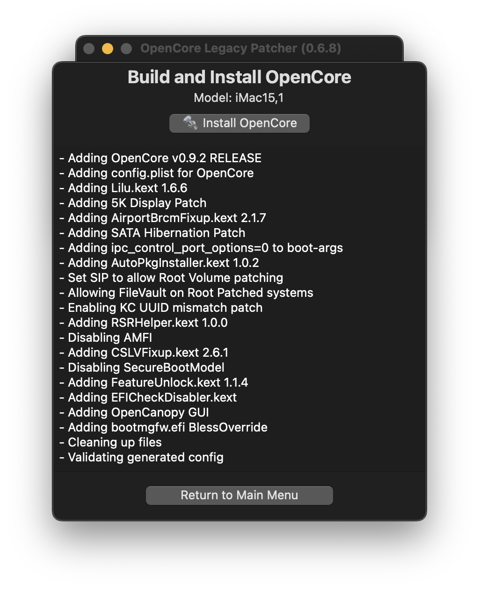

# Building and installing OpenCore

Now that we have a macOS installer, let's now build our OpenCore configuration!

If you haven't downloaded OpenCore Patcher yet, do so now:

* [OpenCore Legacy Patcher Releases](https://github.com/dortania/Opencore-Legacy-Patcher/releases)

Next, run the `OpenCore-Patcher.app`

Here we'll select Build and Install OpenCore and start building:

             

::: warning
OpenCore configurations are hardware specific.
If you're building OpenCore for a different model than you're currently running, it is absolutely necessary to select the proper model from Settings.
:::

| Start Building | Finished Building |
| :--- | :--- |
|  |  |

Once it finishes building, you'll want to select the Install OpenCore button:

* If you created a macOS USB manually and don't see it listed, make sure it's either formatted as GUID/GPT or has a FAT32 partition for OpenCore to reside on.

| Select Drive | Select Partition |
| :--- | :--- |
|  |  |

# Once finished, head to [Booting OpenCore and macOS](./BOOT.md)
