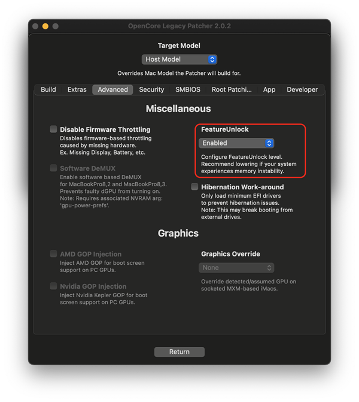
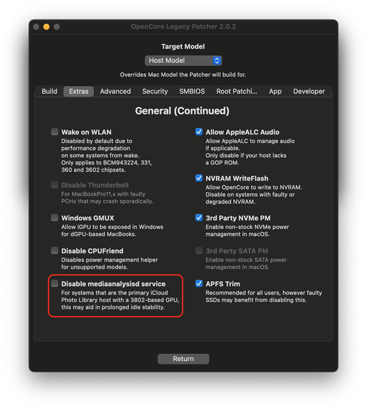

# FAQ

* [Application requirements](#application-requirements)
* [Application versioning](#application-versioning)
* [How do I make sure I'm all up to date?](#how-do-i-make-sure-i-m-all-up-to-date)
* [Why are the settings "not saving"?](#why-are-the-settings-not-saving)
* [Can I use the same USB install media as a universal installer?](#can-i-use-the-same-usb-install-media-as-a-universal-installer)
* [Can I use OTA updates?](#can-i-use-ota-updates)
* [Can I use automatic updates?](#can-i-use-automatic-updates)
* [Why are macOS updates so large?](#why-are-macos-updates-so-large)
* [Can I update to macOS betas?](#can-i-update-to-macos-betas)
* [Can I downgrade macOS while keeping data?](#can-i-downgrade-macos-while-keeping-data)
* [Why is my system slow?](#why-is-my-system-slow)
* [Applications crashing with "illegal instruction"](#applications-crashing-with-illegal-instruction)
* [What is Metal and non-Metal?](#what-is-metal-and-non-metal)
* [What are FeatureUnlock and mediaanalysisd?](#what-are-featureunlock-and-mediaanalysisd)
* [Why isn't iPhone Mirroring working?](#why-isn-t-iphone-mirroring-working)
* [Where is Apple Intelligence?](#where-is-apple-intelligence)


## Application requirements
The patcher application requires **OS X Yosemite 10.10** or later to run.
* **El Capitan 10.11** or later is required to make installers for macOS Ventura
* **High Sierra 10.13** or later is required to make installers for macOS Sonoma and newer.

The patcher is designed to target **macOS Big Sur 11.x to macOS Sequoia 15.x**.
* Other versions may work, albeit in a broken state. No support is provided for any version outside of the above.

## Application versioning

Since 1.0.0, OCLP adheres to a proper versioning scheme with major, minor and bug fix system ([Semantic Versioning](https://semver.org/)).

- First digit: Major changes, including new OS support, API changes, and significant patch set changes, etc
- Second digit: Minor changes, including incoming OS update fixes, minor patch set changes, etc
- Third digit: Bug fixes, primarily hot fixes either due to a regression in prior release or resolving issues in already released OS updates


## How do I make sure I'm all up to date?

Updating the OCLP installation is a three step process, first the application, second the bootloader and finally root patches.

Refer to [Updating OpenCore and patches](https://dortania.github.io/OpenCore-Legacy-Patcher/UPDATE.html) for how to update the application and patches.

## Where are the GUI settings saved?

In OpenCore Legacy Patcher 2.1.0 and newer, the status of settings are saved under ```/Users/Shared/.com.dortania.opencore-legacy-patcher.plist```. The application will utilize this file to keep track of and retain settings for relaunches and application updates, no longer requiring a reconfiguring each time. The user interface will reset if any model other than "Host Model" is selected, as building for a different model will require different settings.

In case of issues, delete the file and restart the application to revert the GUI to default settings, then rebuild OpenCore with newly configured settings.

**Ticking the options in Settings alone will not apply the settings until the "Build and Install OpenCore" process has been redone**, which rebuilds a new OpenCore with the selected settings. Applied settings are saved to a config.plist file inside your EFI partition by the building process.

::: warning

Only settings made within OCLP are accounted for, modifications made directly into the ```config.plist``` file in the EFI partition outside of OCLP **will continue to reset**. Additionally, modifying ```config.plist``` manually may lead to a state where settings showed in the GUI are not in sync compared to settings in use, due to the application not knowing whether the file has been manually modified. 

:::

In versions older than 2.1.0, the status of settings was not tracked. Therefore in these versions GUI will continue to reset to defaults after every launch, requiring settings to be reconfigured each time.

## Can I use the same USB install media as a universal installer?

OpenCore configurations are device specific, due to different quirks needed for different systems. If you are building OpenCore for a different system that you're running, you will have to select the targeted model from Settings before building OpenCore on the USB media.

When building OpenCore on a different system, OCLP cannot be aware of all the hardware installed in the target, meaning safe defaults will be used. However, this may not be the most optimal experience especially with custom hardware. As such it's recommended to rebuild OpenCore **on device** to apply settings that are based on hardware detection, after the OS has been installed.

## Can I use OTA updates?

You can. However it is extremely recommended to use USB drive for major OS upgrades (such as 13 -> 14) to avoid larger issues from potentially occurring.

General updates are usually fine, though it is always a good idea to wait few days to see whether patches break and have to be fixed.

## Can I use automatic updates?

It is extremely recommended to disable automatic updates (even downloading) when using OCLP, as Apple has recently changed the way automatic updates work. Updates are now getting staged during the download process and are already modifying the system volume, which can lead to broken system out of nowhere since the operating system gets into a liminal state between two versions. You can still manually initiate an update when you're ready to do so. 

For a related "System version mismatch" error while root patching and more information, refer to [System version mismatch error when root patching](https://dortania.github.io/OpenCore-Legacy-Patcher/TROUBLESHOOT-APP.html#system-version-mismatch-error-when-root-patching) for troubleshooting.

* Note: macOS Sequoia has begun prompting to enable automatic updates from 15.4 onward after an update install has finished and isn't giving a choice to fully decline, this means you may have to keep doing it again after updating to newer versions.

::: details How to disable updates (click to expand)

**macOS Ventura and newer:**

System Settings -> General -> Software Update -> (i) button next to Automatic Updates -> Disable "Download new updates when available".

**macOS Big Sur and Monterey:**

System Preferences -> Software Update -> Advanced -> Disable "Download new updates when available".

:::

## Why are macOS updates so large?

macOS by default uses a sealed system volume that is unwritable. When the seal is broken, macOS thinks the volume is broken and downloads a full copy of macOS for every update to "repair" it to a known state. In order for root patching to work, this seal has to be broken since root patching by design requires on-disk file manipulation. This is also why root patches have to be reinstalled after each update.

## Can I update to macOS betas?

OCLP patch development and testing happens at the beta phase in order to target a stable release, as such it is impossible for OCLP to support betas properly and previous versions may be incompatible. Only install a beta if you know what you're doing, have your expectations in check and don't mind having to fully reset to recover your system.

Be advised that no help will be given in situations where a beta was installed.

## Can I downgrade macOS while keeping data?

macOS doesn't allow direct downgrades, as such you will have to wipe the disk in order to revert. Backup your data beforehand either via Time Machine, ASR or some other solution.

## Why is my system slow?

**Lacking or broken root patches**

If your system is being **really** slow and macOS is lacking wallpaper and transparency in Dock and menubar, make sure to install root patches to get proper drivers and functionality. Refer to [Applying post install volume patches](https://dortania.github.io/OpenCore-Legacy-Patcher/POST-INSTALL.html#applying-post-install-volume-patches) section for more information. 

**Root patches will be wiped by macOS updates and have to be reinstalled after an update finishes.** 

Patches can also break if automatic updates are enabled and an update prematurely modifies the system volume, refer to [System version mismatch error when root patching](https://dortania.github.io/OpenCore-Legacy-Patcher/TROUBLESHOOT-APP.html#system-version-mismatch-error-when-root-patching) for more information.

**Spotlight**

If your macOS installation is recent, Spotlight starts creating a full disk index which can cause high CPU load, high temps and general slowness. It's recommended to keep the system running for few hours, once Spotlight has indexed the load will ease. A way to check whether it's caused by Spotlight is to open Activity Monitor, choosing "All Processes" from the "View" menu item, then sorting by the CPU value to see if a process called ```mds_stores``` is using a lot of CPU resources.

**Heavier macOS versions**

Newer operating systems are harder to run and can appear more slow. If this is the case, there is not a whole lot to do about it.

**Thermal issues or bad/missing battery**

If you see ```kernel_task``` hogging a lot of CPU resources in Activity Monitor (this also requires View -> All Processes), this means the system is being throttled mostly due to the following reasons:

In laptops, if the battery is either missing or in bad condition, macOS will throttle the CPU quite hard in order to stay running as the charger cannot provide enough power for peak performance. You may try disabling throttling in OCLP settings but this usually leads to unexpected shutdowns during load, when the charger runs out of power to provide. Additionally, trackpad settings will be unavailable on laptops if battery is not present.

Thermal issues can also throttle the CPU, in this case it may be recommended to repaste the system.

You can use [Intel Power Gadget (Web Archive)](https://web.archive.org/web/20220701164200/https://www.intel.com/content/dam/develop/external/us/en/documents/downloads/intel-power-gadget.dmg) to monitor CPU frequency, AVG and REQ should mostly match each other.

## Applications crashing with "illegal instruction"

If the crash log includes a string saying "illegal instruction", this typically means the application requires AVX or AVX2 CPU instructions. 

Since macOS Ventura, AVX2 is required from all Macs supported by it. While OCLP is able to patch macOS to boot without it, many applications are beginning to utilize AVX and AVX2 as well in newer versions because all supported Macs are expected to have them. This creates an issue for older systems where some applications cannot be ran on CPUs lacking such instructions. Some older Macs may need older versions of applications and cannot update to newer versions. AVX was introduced in Sandy Bridge CPU generation and AVX2 in Haswell generation.

In essence, this means that some models are now aging rapidly and newer OS won't always provide support for newer applications because of hardware requirements. If an application still supports macOS versions older than Ventura, it may have a chance of running on an older OS version on the old system, since some Macs running them natively don't support AVX2 and the app takes a different path.

::: details Earliest Mac models supporting AVX instruction (click to expand)

- Macmini5,x (2011)
- iMac12,x (2011)
- MacBookPro8,x (2011)
- MacBookAir4,x (2011)
- MacBook8,x (2015)
- MacPro6,1 (2013)
:::

::: details Earliest Mac models supporting AVX2 instruction (click to expand)

- Macmini7,x (2014)
- iMac14,x (2013)
- MacBookPro11,x (2013)
- MacBookAir6,x (2013)
- MacBook8,x (2015)
- MacPro7,1 (2019)
:::

## What is Metal and Non-Metal?

Metal is Apple's proprietary graphics API that acts as a replacement for OpenGL/OpenCL which fully superseded OpenGL rendering of the operating system starting from macOS Mojave. When the word "Non-Metal" is used, it describes GPUs that are not Metal supported and require using OpenGL instead. Due to deprecation of OpenGL, many newer applications may require Metal rendering and as such will fail to run on systems with Non-Metal GPUs. Some built-in apps like Maps and everything relying on it (such as Find My) will fail to render as well on versions later than Big Sur.

A great rule of thumb is that Macs older than 2012 are non-Metal, with the exception of systems having upgradable GPUs.

::: details macOS GPU Chart

Intel GMA series is completely unsupported, even when using OpenCore Legacy Patcher. 

AMD Navi (RX 5000 - 6000 series) GPUs are non-functional in Mac Pro 2008 to 2012 using Ventura and newer due to lack of AVX2 support.

| Graphics Vendor | Architecture | Series | Supports Metal |
| :--- | :--- | :--- | :--- |
| ATI | TeraScale 1 | HD 2XXX - HD 4XXX | <span style="color:red">No</span> |
| ^^ | TeraScale 2 | HD 5XXX - HD 6XXX | ^^ |
| AMD | GCN (and newer) | HD 7XXX+ | <span style="color:green">Yes</span> |
| NVIDIA | Tesla | 8XXX - 3XX | <span style="color:red">No</span> |
| ^^ | Fermi | 4XX - 5XX | ^^ |
| ^^ | Kepler | 6XX - 7XX | <span style="color:green">Yes</span> |
| ^^ | Maxwell | 8XX - 9XX | <span style="color:red">No (on 10.14 and newer)</span> |
| ^^ | Pascal | 10XX | ^^ |
| Intel | GMA | GMA 900 - GMA X3000 | <span style="color:red">No</span> |
| ^^ | Iron Lake | HD series | ^^ |
| ^^ | Sandy Bridge | HD 3000 | ^^ |
| ^^ | Ivy Bridge (and newer) | HD 4000 | <span style="color:green">Yes</span> |

:::

Refer to the following pages for more information
- [Supported models](https://dortania.github.io/OpenCore-Legacy-Patcher/MODELS.html) 
- [Non-Metal GitHub issue](https://github.com/dortania/OpenCore-Legacy-Patcher/issues/108)
- [Non-Metal Issues](https://dortania.github.io/OpenCore-Legacy-Patcher/TROUBLESHOOT-NONMETAL.html)
- [Hardware troubleshooting](https://dortania.github.io/OpenCore-Legacy-Patcher/TROUBLESHOOT-HARDWARE)


## What are FeatureUnlock and mediaanalysisd?

**Important:** These features have the potential to cause instability in many places and as such a decision has been made to disable them by default (mediaanalysisd only on 3802-based* systems) starting from OpenCore Legacy Patcher version 2.1.0.  If you want to enable these features at the risk of additional instability, you can do so in the OCLP settings and rebuilding OpenCore.

FeatureUnlock may also have issues functioning with some OS versions and systems due to race condition during system bootup. If this happens to you, try rebooting multiple times or different (older) OS versions to see if it will remedy the issue.

FeatureUnlock is an extension to enable some macOS features, including:
- Sidecar
- Universal Control
- AirPlay to Mac
- Continuity Camera
- NightShift (non-Metal)

Further information, requirements and the models affected for FeatureUnlock features can be found [here](https://github.com/acidanthera/FeatureUnlock). 

Medianalysisd is utilized for
- Face detection in Photos
- Live Text

| FeatureUnlock | mediaanalysisd |
| :--- | :--- |
|  |  |


::: details *3802 systems list (click to expand)

* NVIDIA
    * Kepler (600-800 series GPUs)
* Intel
    * Ivy Bridge (3rd generation, HD 4000 series GPUs)
    * Haswell (4th generation, HD/Iris 4000-5000 series GPUs)

These GPUs are typically met in systems from 2012-2015.

:::

## Why isn't iPhone Mirroring working?

iPhone Mirroring requires a T2 chip, which means it will not be available on OCLP patched systems. The connection fails due to failure to establish T2 attestation.

## Where is Apple Intelligence?

Apple Intelligence requires Neural Engine, which is only found in Apple Silicon chips.


