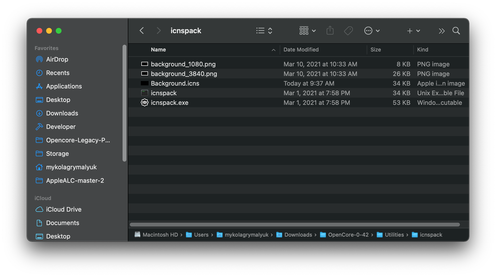
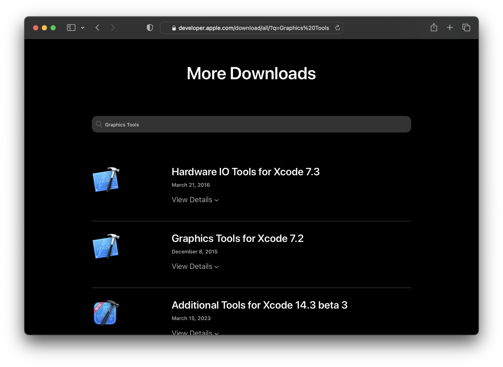
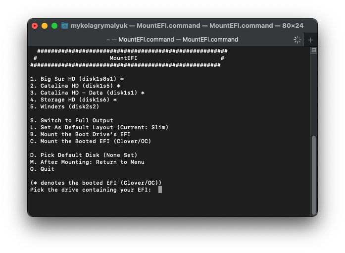
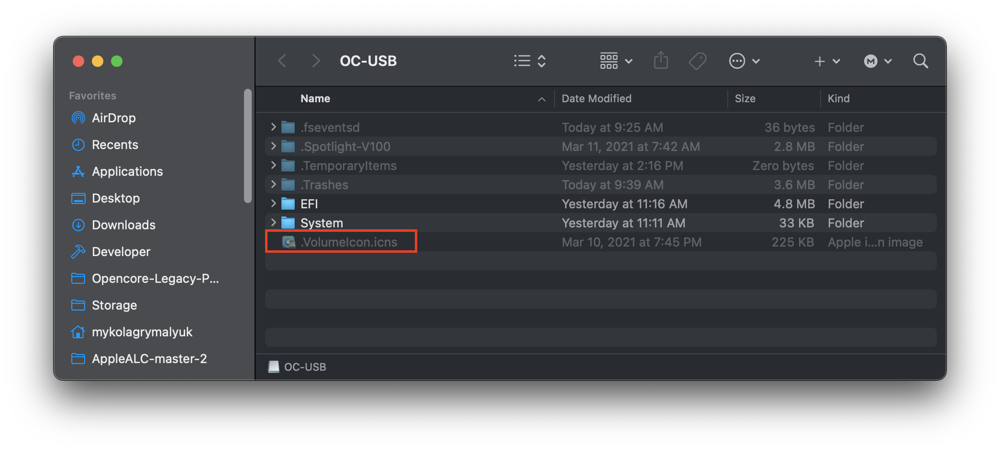

# Creating custom icons for OpenCore and Mac Boot Picker

For users who want to customize their setup to be more personal, OpenCore does allow for custom icons and images in the boot picker.

* [Custom OpenCore icons](#custom-opencore-icons)
* [Custom Mac Boot Picker icons](#custom-mac-boot-picker-icons)
* [Installing updated icons](#installing-updated-icons)

# Custom OpenCore icons

To generate custom OpenCore icons, you'll need the following:

* Images in PNG format
* Each image, with the following res:
  * Cursor — Mouse cursor (mandatory, up to 144x144).
  * Selected — Selected item (mandatory, 144x144).
  * Selector — Selecting item (mandatory, up to 144x40).
  * Left — Scrolling left (mandatory, 40x40).
  * Right — Scrolling right (mandatory, 40x40).
  * HardDrive — Generic OS (mandatory, 128x128).
  * Background — Centred background image. (Recommended max size 1920x1080)
  * Apple — Apple OS (128x128).
  * AppleRecv — Apple Recovery OS (128x128).
  * AppleTM — Apple Time Machine (128x128).
  * Windows — Windows (128x128).
  * Other — Custom entry (see [Entries](https://dortania.github.io/docs/latest/Configuration.html), 128x128).
  * ResetNVRAM — Reset NVRAM system action or tool (128x128).
  * Shell — Entry with UEFI Shell name for e.g. OpenShell (128x128).
  * Tool — Any other tool (128x128).

Note, for each image we recommend having one of double the size. This ensures that icons are scaled correctly since .icns support dedicated images depending on HiDPI or not.

Once you have a custom image you want to use(for example, as a background), download the [latest release of OpenCorePkg](https://github.com/acidanthera/OpenCorePkg/releases) and enter the `Utilities/icnspack/` folder:


Now `cd` to this folder in terminal and run the following:

```sh
./icnspack Background.icns <insert_x1_image> <insert_x2_image>
```

Once done, you'll see your custom icon generated in `icnspack`'s folder:



# Custom Mac Boot Picker icons

Custom boot picker icons are much more complicated on Legacy Macs. On late 2013+ Macs, the [Custom OpenCore icons](#custom-opencore-icons) method will work just fine. However, on many 2012 and older Macs, the icons generated will be incompatible with the firmware.

To generate legacy icons, you'll need the following:

* A machine running macOS 10.4 through 10.11
* Icon Composer.app (Requires Apple Developer Account for official download)
  * Users without a developer account can find mirrors here:
    * [Icon Composer 10.6](https://github.com/dortania/OpenCore-Legacy-Patcher/blob/main/docs/Icon-Composer-10.6.zip)
    * [Icon Composer 10.11](https://github.com/dortania/OpenCore-Legacy-Patcher/blob/main/docs/Icon-Composer-10.11.zip)
* PNG Image you wish to convert

Head to [developer.apple's More Downloads page](https://developer.apple.com/download/more/) and search for `Graphics Tools` that is supported by your OS(note for 10.6 and older, the app is hidden inside `Developer Tools`):



Once downloaded, open the disk image and you'll find Icon Composer.app:


Now run the app and simply drag the images to each section as so:


Now save and export the new icns file.

# Installing updated icons

To install, please ensure that Vault was disabled when you built OpenCore. If you're unsure, simply rebuild OpenCore with the Patcher setting "Vault" set to false.

* <span style="color:red"> Warning</span>: Editing your OpenCore EFI incorrectly can result in a bricked install. Please ensure you have a natively supported version of macOS installed to boot into in case of issues.

Now that you've verified that you can edit OpenCore safely, you'll need to mount the drive that OpenCore is stored on. To do this, download [MountEFI](https://github.com/corpnewt/MountEFI) and run it:



Select the drive you installed OpenCore to and mount it.

* [Updating OpenCore icons](#updating-opencore-icons)
* [Updating Mac Boot Picker icons](#updating-mac-boot-picker-icons)

### Updating OpenCore icons

Head to `EFI/OC/Resources/Image/` on your drive and you'll see all the custom icons. For Background.icns, we need to ensure the file matches the theme OpenCore has set so we add the prefix `Modern` to it:


Now reboot and you should see your updated icon(s)!

### Updating Mac Boot Picker icons

Updating the Mac Boot Picker icons is actually quite simple. On the root of your drive, simply drop the icon into the root of the drive with the name `.VolumeIcon.icns`



Now reboot and you'll see the new icon!
