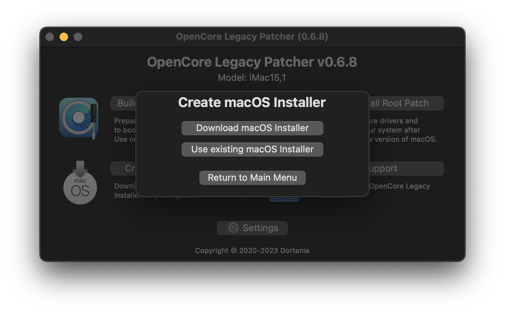
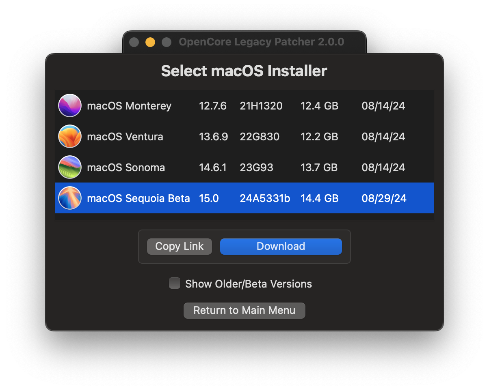
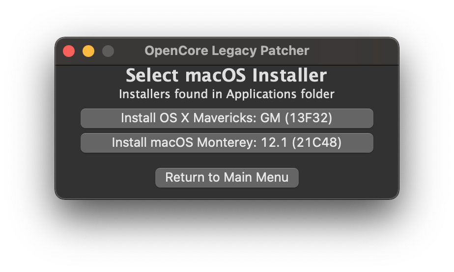
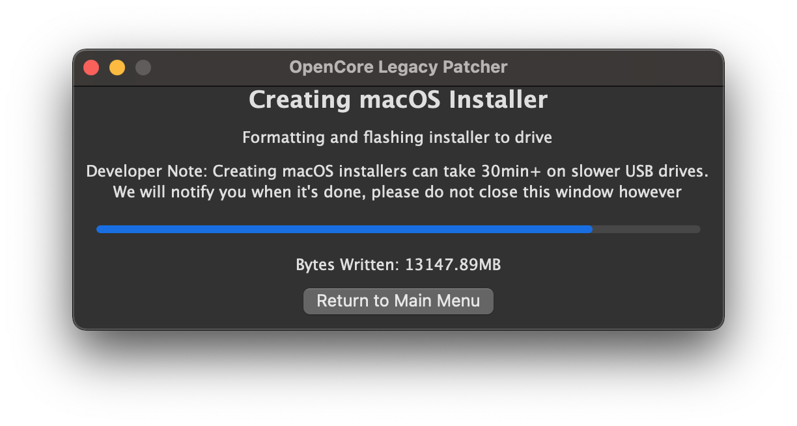

# Creating macOS Installers

This document is centered around downloading and writing the macOS installer to a USB drive. If you're planning to install macOS on other system than you're currently running, it is recommended to choose the Mac model in Settings now before proceeding, so that automatic root patching works correctly later on.

* Note: A 32GB drive is recommended, later versions of Sonoma and Sequoia cannot fit installer and patches to a 16GB disk. 16GB drive may work for older versions.

## Downloading the installer

To start off, you'll want to grab the app:

* [OpenCore Legacy Patcher Release Apps](https://github.com/dortania/OpenCore-Legacy-Patcher/releases)

Once downloaded, open the app and you should be greeted by the main menu. 

First, we'll want to select the "Create macOS Installer" button. This will present you with 2 options.

For this example, we'll assume you'll need an installer. Select the "Download macOS installer" to get you a list of installers. Click to download the version you want.

| Main menu | Installer creation menu | Available installers |
| :--- | :--- | --- |
|  |  |  |

## Creating the installer

Once the download is finished, you can proceed to write the installer onto a USB drive.

* Note: The entire USB drive will be formatted

| Select Downloaded Installer | Select disk to format |
| :--- | :--- |
|  |  |

Now the patcher will start the installer flashing!

| Flashing | Success Prompt | Finished Flashing |
| :--- | :--- | :--- |
|  |  |  |

# Once finished, head to [Building and installing OpenCore](./BUILD.md)
