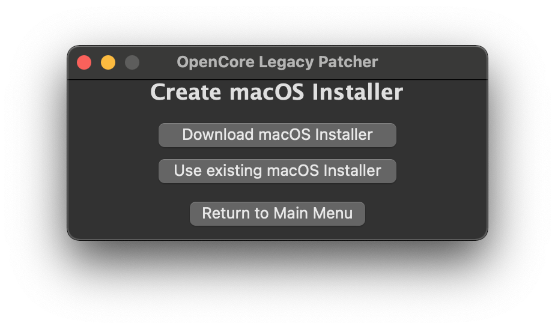
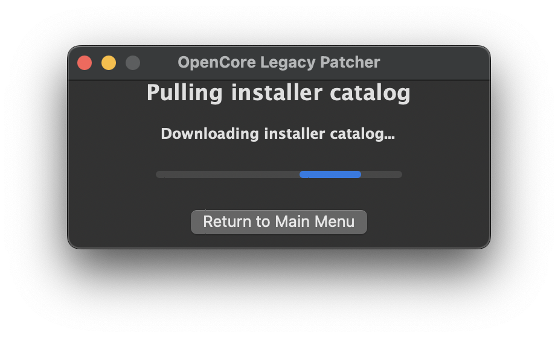
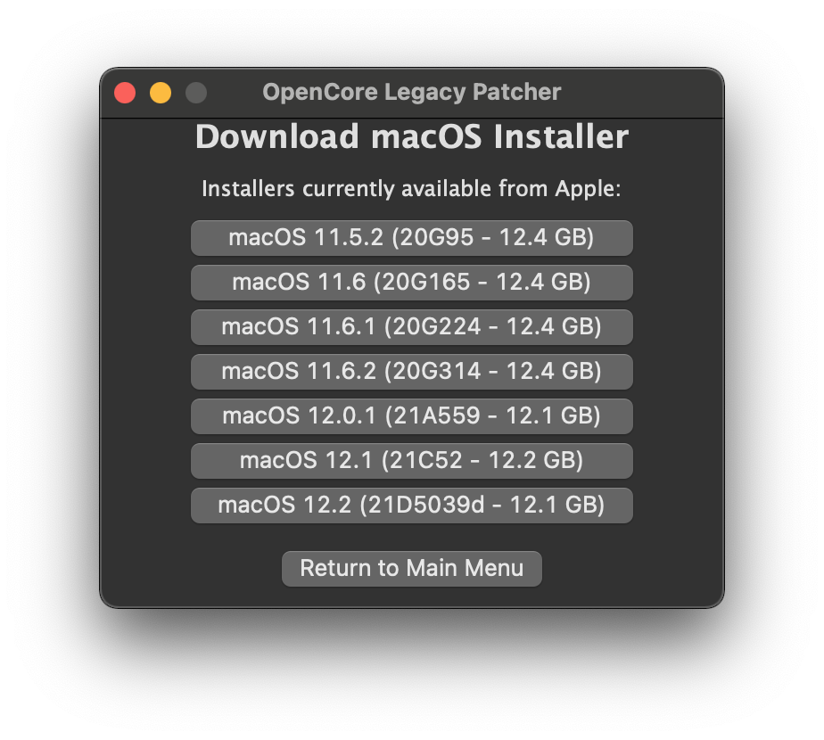
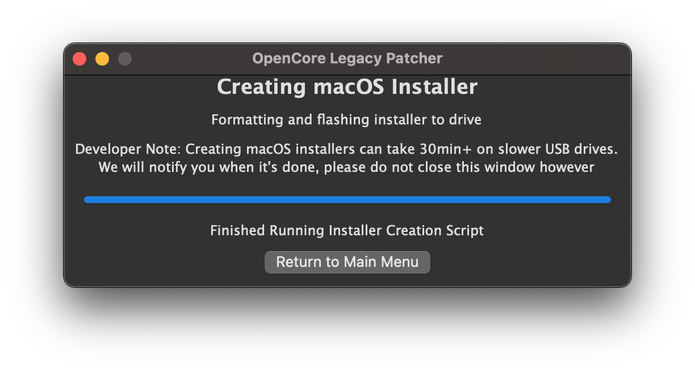

# Download and build macOS Installers

This doc is centered around downloading and writing the macOS installer to a USB. If you're already familiar with how to do this, you can skip.

* Note: 16GB+ USB will be required for the installer

## Creating the installer

With OpenCore Legacy Patcher, our new GUI includes a download menu for macOS installers. So to start off, you'll want to grab our app:

* [OpenCore Legacy Patcher Release Apps](https://github.com/dortania/OpenCore-Legacy-Patcher/releases)

For this guide, we'll be using the standard OpenCore-Patcher (GUI).

Once downloaded, open the app and you should be greeted with this menu:

First we'll want to select the "Create macOS Installer" button. This will present you with 2 options:

For this example, we'll assume you'll need an installer. Selecting this option will download Apple's Installer Catalogs and build a list for you to choose:

| Downloading | Listed Installers |
| :--- | :--- |
|  |  |

Since the patcher officially supports Big Sur and newer for patching, only those entires will be shown. For ourselves, we'll select 12.1 as that's the latest public release at the time of writing. This will download and install the macOS installer to your applications folder.

| Downloading the Installer | Requesting to install | Finished Installing |
| :--- | :--- | :--- |
|  |  |  |

Once finished, you can proceed to write the installer onto a USB drive.

* Note: The entire USB drive will be formatted

| Select Downloaded Installer | Select disk to format |
| :--- | :--- |
|  |  |

Now the patcher will start the installer flashing!

| Flashing | Success Prompt | Finished Flashing |
| :--- | :--- |
|  |  |  |

# Once finished, head to [Building and installing OpenCore](./BUILD.md)
