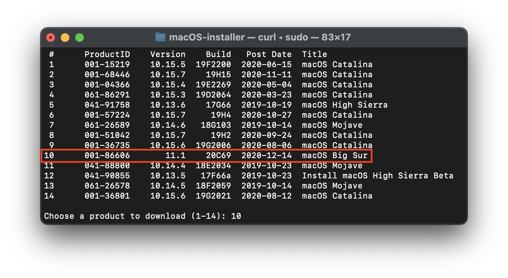
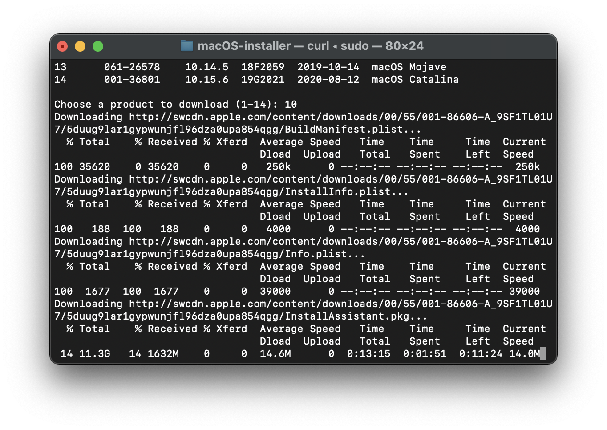
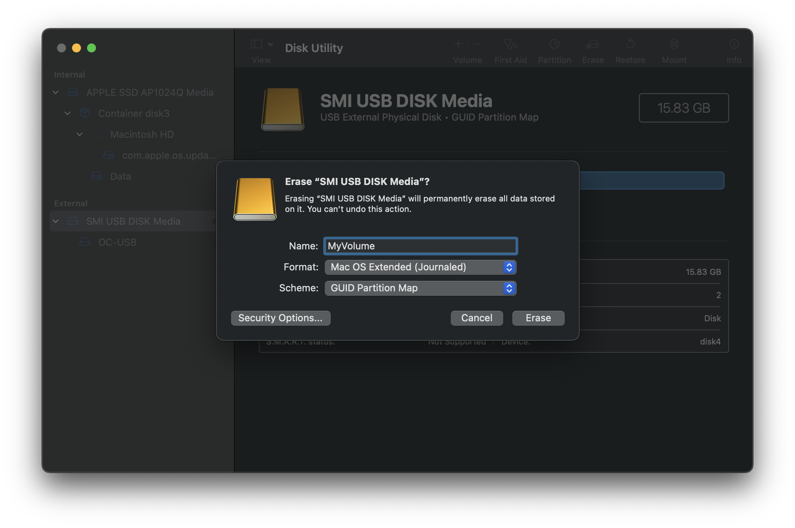

# Download and build macOS Installers

* [Downloading](#downloading)
* [Building](#building)

This doc is centered around downloading and writing the macOS installer to a USB. If you're already familiar with how to do this, you can skip.

* Note: 16GB+ USB will be required for the installer

## Downloading

The simplest way to download macOS installs would be to use installinstallmacos:

```sh
[ ! -d ~/macOS-installer/ ] && mkdir ~/macOS-installer; cd ~/macOS-installer; [ ! -f ~/macOS-installer/installinstallmacos.py ] && curl -O https://raw.githubusercontent.com/munki/macadmin-scripts/main/installinstallmacos.py ; sudo python installinstallmacos.py
```

* Note: On El Capitan (10.11) and older, you'll need to specify a catalog at the end of the command:

```
--catalogurl https://swscan.apple.com/content/catalogs/others/index-11-10.15-10.14-10.13-10.12-10.11-10.10-10.9-mountainlion-lion-snowleopard-leopard.merged-1.sucatalog
```



As you can see, we get a nice list of macOS installers. If you need a particular versions of macOS, you can select it by typing the number next to it. For this example we'll choose 10:



This is going to take a while as we're downloading the entire 12GB+ macOS installer.

Once finished, you'll find in your `~/macOS-Installer/` folder a DMG containing the macOS Installer, called `Install_macOS_11.1-20C69.dmg` for example. Mount it and you'll find the installer application.

* Note: We recommend to move the Install macOS.app into the `/Applications` folder, as we'll be executing commands from there.
* Note 2: Running Cmd+Shift+G in Finder will allow you to easily jump to `~/macOS-installer`


## Building

Now we'll be formatting the USB to prep for both the macOS installer and OpenCore. We'll want to use macOS Extended (HFS+) with a GUID partition map(Using GUID is important for the patcher). This will create two partitions: the main `MyVolume` and a second called `EFI` which is used as a boot partition where your Mac's firmware will check for boot files. `EFI` partitions will be hidden by default, so don't worry if you don't immediately see them.

* Note: By default, Disk Utility only shows partitions – press Cmd/Win+2 to show all devices (alternatively you can press the View button)



Next run the `createinstallmedia` command provided by [Apple](https://support.apple.com/en-us/HT201372). Note that the command is made for USB's formatted with the name `MyVolume`:

```sh
sudo /Applications/Install\ macOS\ Big\ Sur.app/Contents/Resources/createinstallmedia --volume /Volumes/MyVolume
```

* Note: You can also replace the `createinstallmedia` path with that of where your installer's located (same idea with the drive name).


# Once finished, head to [Building and installing OpenCore](./BUILD.md)
