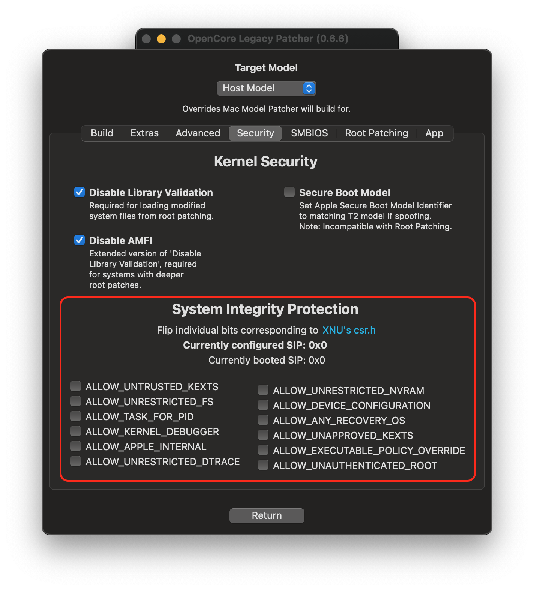
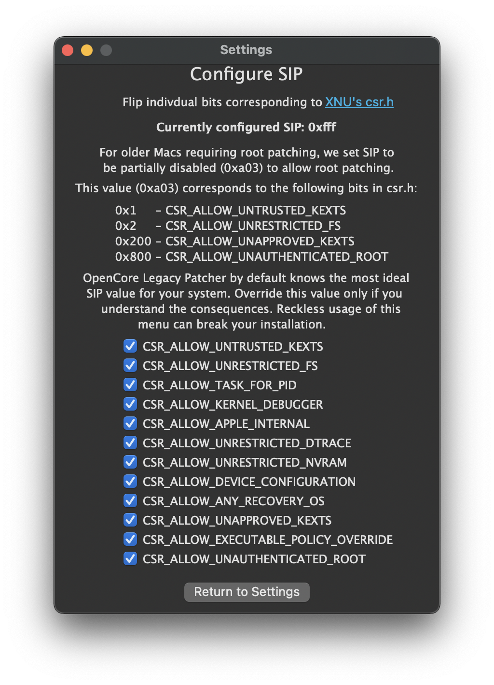
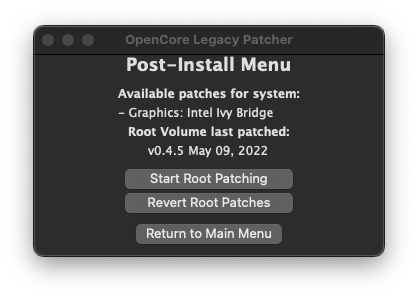
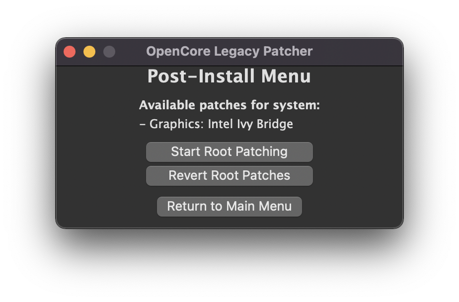

# Post-Installation

* [Booting without USB drive](#booting-without-usb-drive)
* [Booting seamlessly without Verbose or OpenCore Picker](#booting-seamlessly-without-verbose-or-opencore-picker)
* [Applying Post Install Volume Patches](#applying-post-install-volume-patches)

## Booting without USB drive

Once you've installed macOS through OpenCore, you can boot up and go through the regular install process. To boot without the USB drive plugged in is quite simple:

* Download OpenCore Legacy Patcher
* Change Patcher settings as you'd like
* Build OpenCore again
* Install OpenCore to internal drive
* Reboot holding Option, and select the internal EFI

And voila! No more USB drive required.

## Booting seamlessly without Verbose or OpenCore Picker

To do this, run the OpenCore Patcher and head to Patcher Settings:

| GUI Settings | TUI Settings
| :--- | :--- |
| |  |

Here you can change different patcher settings, however the main interest is:

* Show Boot Picker (GUI)
* Set ShowPicker Mode (TUI)

Once you've toggled them both off, build your OpenCore EFI once again and install to your desired drive. Now to show the OpenCore selector, you can simply hold down the "ESC" key while clicking on EFI boot, and then you can release the "ESC" key when you see the cursor arrow at the top left.

## Enabling SIP

For many users, SIP will be lowered by default on build. For Intel HD 4000 users, you may have noticed that SIP is partially disabled. This is to ensure full compatibility with macOS Monterey and allow seamless booting between it and older OSes. However for users who do not plan to boot Monterey, you can re-enable under Patcher Settings.

Note: Machines running macOS Ventura or systems with non-Metal GPUs cannot enable SIP outright, due to having a patched root volume. Enabling will brick the installation.

| SIP Enabled | SIP Lowered (Root Patching) | SIP Disabled |
| :--- | :--- | :--- |
|  |  |  |

:::warning

If you're unsure whether you should enable SIP, leave it as-is. Systems where you have already ran the Post Install Root Patching cannot enable SIP without potentially breaking the current install.

:::

## Applying Post Install Volume Patches

Post Install Volume Patches, sometimes also called root patches, are patches that have to be installed to disk for some older Macs to gain back functionality.

OCLP v0.4.4 and higher include an autopatcher, which will automatically root patch your system but **only if the USB install media was created within OCLP.**

Users with OCLP v0.4.4 or higher will also be prompted to install these patches after macOS updates or whenever patches are not detected on the system. We recommend rebuilding OpenCore with the latest version of OCLP to take advantage of these new features.

In OCLP v0.4.5 a new indicator was added to help users to see if, when and on what version the system was root patched. Note that the "Available patches" section above this does not track the status and will always show the patches that are available, whether they're installed or not.

| Automatic install prompt in 0.4.4+ | Last patched status in 0.4.5+ |
| :--- | :--- |
|  |   |

### Running Post Install patches manually

If you're using OCLP v0.4.3 or earlier, or need to run the patcher manually, you can do so with the app. There is no harm in trying to run the Patcher, as without compatible hardware, nothing will be done. You can see below on whether your hardware needs root volume patching or not.

| Listing Patches | Patching Finished |
| :--- | :--- |
|  |  |

:::warning

With macOS Ventura and Macs with AMD Legacy GCN GPUs (ie. Metal), Root Patching requires a network connection to grab Apple's Kernel Debug Kit to start root patching. If your system is unable to connect to the internet, you can manually download a KDK from Apple's site:

* [Apple's Developer Download Page](https://developer.apple.com/download/all/?q=Kernel%20Debug%20Kit)

Grab the closet Kernel Debug Kit to the OS you installed, and install it to the machine running Ventura.

Machines that require this are those with AMD Metal dGPUs:
* 2008 - 2013 Mac Pros (MacPro3,1 - 6,1)
* 2009 - 2016 iMacs (iMac10,1 - 17,1)
* 2015 15" MacBook Pro with a dGPU (MacBookPro11,5)

:::

Below entires represent GPUs no longer natively supported, ie. requiring root volume patch with OpenCore Legacy Patcher:

:::details GPUs requiring patching in macOS Big Sur

* NVIDIA:
  * Tesla (8000 - 300 series)
* AMD:
  * TeraScale (2000 - 6000 series)
* Intel:
  * Iron Lake
  * Sandy Bridge (2000 - 3000 series)

:::

:::details GPUs requiring patching in macOS Monterey

* NVIDIA:
  * Tesla (8000 - 300 series)
  * Kepler (600 - 800 series)
* AMD:
  * TeraScale (2000 - 6000 series)
* Intel:
  * Iron Lake
  * Sandy Bridge (2000 - 3000 series)
  * Ivy Bridge (4000 series)

:::

:::details Wireless Cards requiring patching in macOS Monterey

* Broadcom:
  * BCM94328
  * BCM94322
* Atheros

:::

:::details GPUs requiring patching in macOS Ventura

* NVIDIA:
  * Kepler (600 - 800 series)
* AMD:
  * GCN 1-3 (7000 - R9 series)
  * Polaris (RX 4xx/5xx series, if CPU lacks AVX2)
* Intel:
  * Ivy Bridge (4000 series)
  * Haswell (4400, 4600, 5000 series)
  * Broadwell (6000 series)
  * Skylake (500 series)

:::
