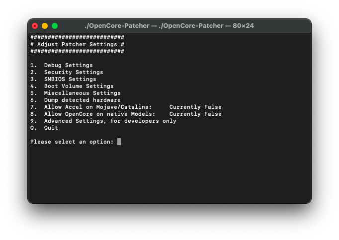

# Post-Installation

* [Booting without USB drive](#booting-without-usb-drive)
* [Booting seamlessly without Verbose or OpenCore Picker](#booting-seamlessly-without-verbose-or-opencore-picker)
* [Applying Post Install Volume Patches](#applying-post-install-volume-patches)

## Booting without USB drive

Once you've installed macOS through OpenCore, you can boot up and go through the regular install process. To boot without the USB drive plugged in is quite simple:

* Download OpenCore Legacy Patcher
* Change Patcher settings as you'd like
* Build OpenCore again
* Install OpenCore to internal drive
* Reboot holding Option, and select the internal EFI

And voila! No more USB drive required

## Booting seamlessly without Verbose or OpenCore Picker

To do this, run the OpenCore Patcher and head to Patcher Settings:

Here you can change different patcher settings, however the main interest is:

* Set ShowPicker Mode

Once you've toggled them both off, build your OpenCore EFI once again and install to your desired drive. Now to show the OpenCore selector, you can simply hold down the "ESC" key while clicking on EFI boot, then you can release the "ESC" key when you see the cursor arrow at the top left.

## Enabling SIP

For many users, SIP will be enabled by default on build. For Intel HD 4000 users, you may have noticed that SIP is disabled. This is to ensure full compatibility with macOS Monterey and allow seamless booting between it and older OSes. However for users who do not plan to boot Monterey, you can re-enable under Patcher Settings.

Note: Machines with non-Metal GPUs cannot enable SIP in Big Sur either due to patched root volume

Note 2: NVRAM may need to be reset to ensure SIP is correctly re-enabled

## Applying Post Install Volume Patches

For users with unsupported GPUs/wifi cards, you'll need to run the Post Install Root Volume patches to regain functionality. See below on whether your hardware needs root volume patching. 

* Hint: Try running the root volume patch option, the Patcher will determine and install patches only when required. So there is no harm in applying them

::: details Unsupported GPUs in macOS Big Sur

* Nvidia:
  * Tesla (8000 - 300 series)
* AMD:
  * TeraScale (2000 - 6000 series)
* Intel:
  * Iron Lake
  * Sandy Bridge (2000 - 3000 series)

:::

::: details Unsupported GPUs in macOS Monterey

* Nvidia:
  * Tesla (8000 - 300 series)
  * Kepler (600 - 800 series)
* AMD:
  * TeraScale (2000 - 6000 series)
* Intel:
  * Iron Lake
  * Sandy Bridge (2000 - 3000 series)
  * Ivy Bridge (4000 series)

:::

::: details Unsupported Wireless Cards in macOS Monterey

* Broadcom:
  * BCM94328
  * BCM94322
* Atheros

:::

To apply the Post-Install Volume patches, select option #3 as shown below:

And go ahead to option #1 and let the OCLP patcher apply the needed legacy video patches.

Reboot your system and check out the now working graphics acceleration on your legacy system. This is still Beta software.
