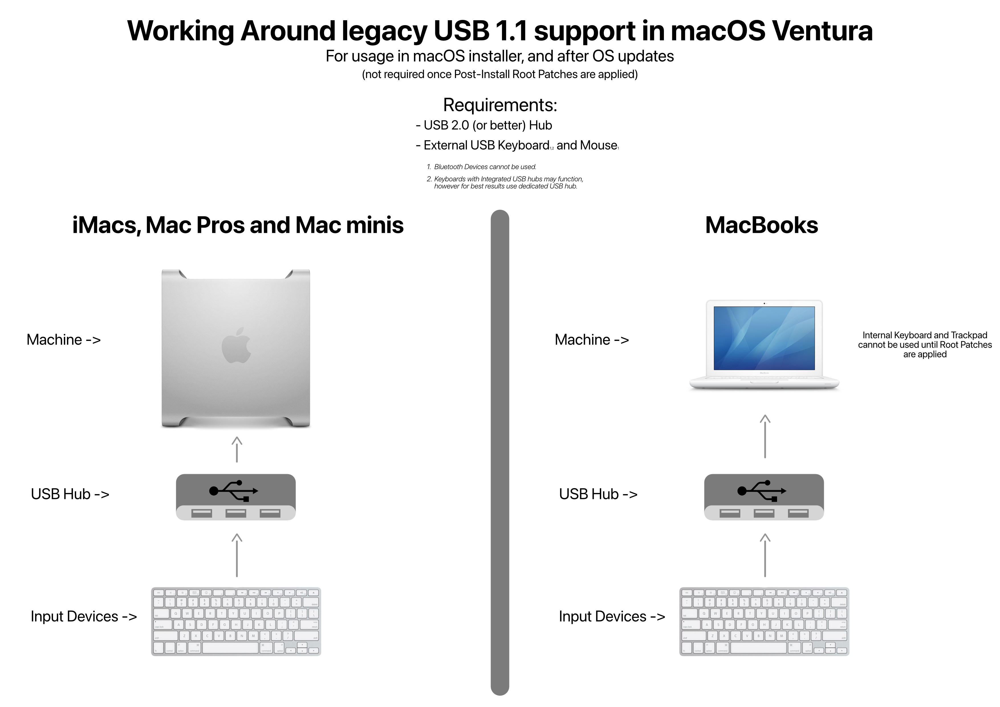

*Well here we are again, it's always such a pleasure~* 

Apple has yet again dropped a bunch of models, continuing their journey on discontinuing Intel Macs. With the release of OpenCore Legacy Patcher v1.0.0, early support for macOS Sonoma has been implemented.

## Versioning

With v1.0.0, we'll be switching to a proper major, minor and bug fix system ([Semantic Versioning](https://semver.org/)). This means the coming release will be version 1.0.0, and future releases plan to follow this scheme:

- First digit: Major changes, including new OS support, API changes, and significant patch set changes, etc
- Second digit: Minor changes, including incoming OS update fixes, minor patch set changes, etc
- Third digit: Bug fixes, primarily hot fixes either due to a regression in prior release or resolving issues in already released OS updates


## Newly dropped hardware

* MacBook10,1:       MacBook (Retina, 12-inch, 2017)
* MacBookPro14,1:    MacBook Pro (13-inch, 2017, Two Thunderbolt 3 ports)
* MacBookPro14,2:    MacBook Pro (13-inch, 2017, Four Thunderbolt 3 Ports) 
* MacBookPro14,3:    MacBook Pro (15-inch, 2017)
* iMac18,1:          iMac (21.5-inch, 2017)
* iMac18,2:          iMac (Retina 4K, 21.5-inch, 2017)
* iMac18,3:          iMac (Retina 5K, 27-inch, 2017)

## Current status

OpenCore Legacy Patcher v1.0.0 will support Sonoma for all models normally supported by the Patcher, however some challenges remain. You can find information about them below.

## Issues

* [Widgets freezing on Intel and Haswell systems](#widgets-freezing-on-ivy-and-haswell-systems)
* [T1 Security chip](t1-security-chip)
* [USB 1.1 (OHCI/UHCI) Support](#usb-11-ohciuhci-support)

### Widgets freezing on Ivy and Haswell systems

Opening the widget board on Intel Ivy and Haswell (3802) based systems can freeze the system.

::: details Models with Ivy and Haswell GPU's

__Intel Ivy Bridge__

```sh
Applicable Models:
- MacBookAir5,x
- MacBookPro9,x
- MacBookPro10,x
- iMac13,x
- Macmini6,x
```
__Intel Haswell__

```sh
Applicable Models:
- MacBookAir6,x
- MacBookPro11,x
- iMac14,x
- iMac15,1 (internal, headless iGPU)
- Macmini7,1
```
::: 

### T1 Security chip

Sonoma has removed support for T1 chips found in most 2016 and 2017 Macs. Therefore on these systems, the following will not function:

* Enable or disable FileVault
* Open the Password Settings window
* Add fingerprints (if upgrading, existing fingerprints will be deleted)
* Add cards to Apple Pay

::: warning ATTENTION: Additionally, due to Sonoma no longer caring about T1, erasing the entire drive will remove the T1 firmware and it won't be reinstalled.
:::
No known solution to resolve supporting, a significant amount of time will be required to understand how both the T1 stack works, as well as where the core issue lies for support.

[More information here](https://github.com/dortania/OpenCore-Legacy-Patcher/issues/1103)

### USB 1.1 (OHCI/UHCI) Support

For Penryn systems, pre-2013 Mac Pros and Xserve, USB 1.1 support was outright removed in macOS Ventura and naturally this continues in Sonoma. 
While USB 1.1 may seem unimportant, it handles many important devices on your system. These include:

* Keyboard and Trackpad for laptops
* IR Receivers
* Bluetooth

With OpenCore Legacy Patcher v0.6.0+, basic support has been implemented via Root Volume patching. However due to this, users will need to use a USB hub for installation and post-OS updates when patches are cleaned:



::: warning The following systems rely on USB 1.1

* iMac10,x and older
* Macmini3,1 and older
* MacBook7,1 and older
* MacBookAir3,1 and older
* MacPro5,1 and older
* Xserve 3,1 and older
:::

[More information here](https://github.com/dortania/OpenCore-Legacy-Patcher/issues/1021)

## Graphics support
This build includes both Legacy Metal and non-Metal patches for macOS Sonoma. Refer to the following links for more information about Legacy Metal and non-Metal support and their respective issues.

* [Legacy Metal](https://github.com/dortania/OpenCore-Legacy-Patcher/issues/1008) 
* [Non-Metal](https://github.com/dortania/OpenCore-Legacy-Patcher/issues/108)

