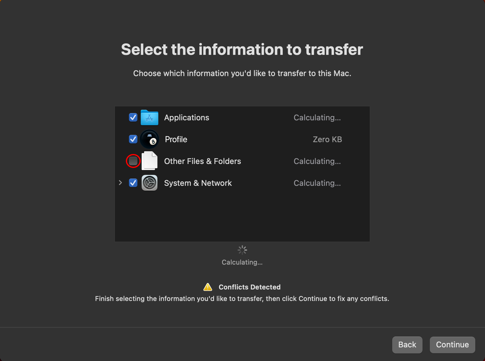

# Restoring Time Machine backup

OCLP automatically installs root patches when installing from the USB drive for the first time to ensure smooth operation of the first time settings. However, as an unfortunate side effect, doing a full restore via Time Machine breaks while root patches are installed and restoring requires a few tricks to avoid a kernel panic. Below are two different methods to restore.

**Method 2 is only supported on Monterey and newer. Big Sur does not support snapshot reversion.**

::: warning Warning for Sequoia

Time Machine on Sequoia may not function even after uninstalling root patches, leading to a loop with "Migration Finished" window. If you encounter this issue, restore on older OS and then upgrade to Sequoia.

:::

## Method 1 - Restore with root patches installed (partial)

**Warning:** Be advised that with this method, folders **other than** "Desktop", "Documents", "Applications" etc (main folders under profile) may not be restored. If you want a full restore, use method 2 below.

1. Start Time Machine restore either in Setup Assistant (first time settings) or Migration Assistant.
2. When asked to select information to transfer, **uncheck** "Other files and folders" as seen in the image below.
3. Start transfer.

             

Now you should be restored with your user profile, applications and settings. 

## Method 2 - Restore without root patches (full)

1. In first time settings (Setup Assistant), do not restore the backup. Instead do all settings like you would want to start fresh.
2. Once you reach desktop, open the OCLP application and revert root patches in the Post Install Volume Patches section.
3. Restart your machine.
   * Note: Your Mac will feel slow due to lack of graphics drivers and resolution may be wrong. WiFi will also be unavailable in most cases, if your backup is on a network drive, use Ethernet.
4. Login and start Migration Assistant.
5. Go through the restoring process.
6. Once finished, go into the OCLP app and reinstall the root patches.

Now you should be fully restored with Time Machine and also running with all patches.

