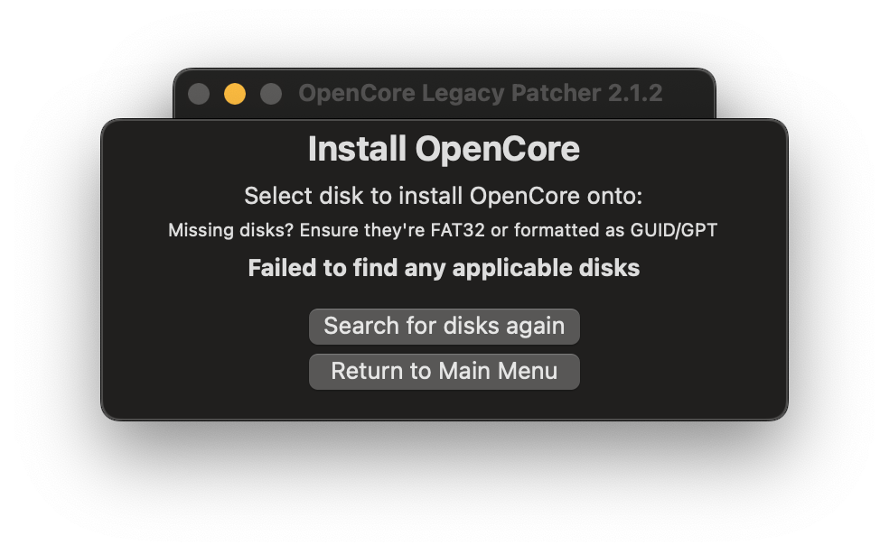

# Application issues

* [OpenCore Legacy Patcher not launching](#opencore-legacy-patcher-not-launching)
* [Privileged Helper Tool not found](#privileged-helper-tool-not-found)
* ["You don't have permission to save..." error when creating USB installer](#you-don-t-have-permission-to-save-error-when-creating-usb-installer)
* [Internal disk missing when building OpenCore](#internal-disk-missing-when-building-opencore)
* ["Unable to resolve dependencies, error code 71" when root patching](#unable-to-resolve-dependencies-error-code-71-when-root-patching)
* [System version mismatch error when root patching](#system-version-mismatch-error-when-root-patching)


## OpenCore Legacy Patcher not launching

If the application won't launch (e.g. icon will bounce in the Dock), try launching OCLP via Terminal by typing the following command.

```sh
/Library/Application Support/Dortania/OpenCore-Patcher.app/Contents/MacOS/OpenCore-Patcher
```

## Privileged Helper Tool not found

OCLP needs a Privileged Helper Tool to run parts of the application as root. If you encounter this error, reinstall OCLP using the PKG installer to fix Privileged Helper Tool. If your system lacks WiFi connection due to lack of patches, use Ethernet. You can also use another computer to download the app and move it to a USB drive.


  * In OCLP 2.3.0 and newer, using PKG is the only way to install and app.zip method has been discontinued.

## "You don't have permission to save..." error when creating USB installer

In some cases, a following error saying "The bless of the installer disk failed" stating the reason as "You don't have permission to save..." may appear. 


<div align="left">
             
</div>


To resolve this, you may try adding Full Disk Access permission for OpenCore Legacy Patcher. To add it, first go to the settings

* Ventura and Sonoma: Go to System Settings -> Privacy and Security -> Full Disk Access

* Big Sur and Monterey: Go to System Preferences -> Security and Privacy -> Full Disk Access

Enable OpenCore-Patcher in the list. If not found on the list, press the + sign to add a new entity and find OpenCore Legacy Patcher from Applications.

Restart OpenCore Legacy Patcher and try creating your USB drive again.

Optional: After you've created your USB drive, you can remove OpenCore Legacy Patcher from Full Disk Access again.

## Internal disk missing when building OpenCore

If you're using a brand new disk that has not been used before or was never formatted in any macOS type, you may face the following error in OCLP when trying to build on the internal disk.

<div align="left">
             
</div>

There are two ways to to try and resolve this.

1. Create a new FAT32 partition using Disk Utility, sized at around 100MB, naming does not matter. OpenCore will detect it and you will be able to build your EFI there.

2. When installing macOS, choose "View -> Show all devices" in Disk Utility and format the entire disk by choosing the topmost option in the sidebar.

<div align="left">
             
</div>

## "Unable to resolve dependencies, error code 71" when root patching

If you're getting this error, it typically means you have some offending kernel extensions, to fix this you will have to clear them.

Semi-automated way:

1. Open Terminal
2. Type `sudo zsh`
3. Type `cd "/Volumes/Macintosh HD/Library/Extensions" && ls | grep -v "HighPoint*\|SoftRAID*" | xargs rm -rf`
   * Make sure to rename "Macintosh HD" to what your drive name is
4. Run OCLP root patcher again
   
Manual way:

1. Navigate to /Library/Extensions
2. Delete everything **except** HighPointIOP.kext, HighPointRR.kext and SoftRAID.kext
3. Run OCLP root patcher again

If there is no success, navigate to "/Library/Developer/KDKs" and delete everything.

If still no success, type `sudo bless --mount "/Volumes/Macintosh HD/" --bootefi --last-sealed-snapshot` 
* Make sure again to rename "Macintosh HD" to what your drive name is

Run OCLP root patcher again.

## System version mismatch error when root patching

Due to a change by Apple, updates now modify the system volume **already while downloading**, which can lead to broken patches out of a sudden, since the operating system gets into a liminal state between two versions. Hence while root patching, you may get an error that looks like the following: 

`SystemVersion.plist build version mismatch: found 15.4 (24E247), expected 13.7.5 (22H527)`

In this example, it is telling that a version 13.7.5 (Ventura) is expected which is currently running but macOS has already staged an update to version 15.4 (Sequoia) and has already modified the filesystem to prepare for an update, including writing the new version in SystemVersion.plist where OCLP is able to read it from. The "version mismatch" error is a safeguard preventing OCLP from patching on a system that is in a weird liminal state, to avoid leading to a very likely boot failure.

There are few options to resolve it:

1. Update/upgrade to the version already staged.
   * This option works only if the newer version is currently supported by OCLP.
2. Reinstall macOS.
   * You can try doing an in-place install without wiping the disk to keep your data but this may not be possible due to the OS being partially on newer version and it will complain about downgrade.
3. Use an experimental "PurgePendingUpdate" tool [from the Discord server](https://discord.com/channels/417165963327176704/1253268648324235345/1257348959454625985).
   * Download it and then run it in Terminal to get rid of a pending update, then repatch again. If "purge failed" appears, you can ignore it.
   * Sometimes you may have to give the file an execution permission with `chmod +x` and putting the application path after the command (type or drag the file) before the tool can be ran.
   * This may be integrated into OCLP later on, however there is currently no ETA.

**Disabling automatic macOS updates is extremely recommended once recovered, to prevent it from happening again.**

* Note: macOS Sequoia has begun prompting to enable automatic updates from 15.4 onward after an update install has finished and isn't giving a choice to fully decline, this means you may have to keep doing it again after updating to newer versions.

::: details How to disable updates (click to expand)

**macOS Ventura and newer:**

System Settings -> General -> Software Update -> (i) button next to Automatic Updates -> Disable "Download new updates when available".

**macOS Big Sur and Monterey:**

System Preferences -> Software Update -> Advanced -> Disable "Download new updates when available".

:::


