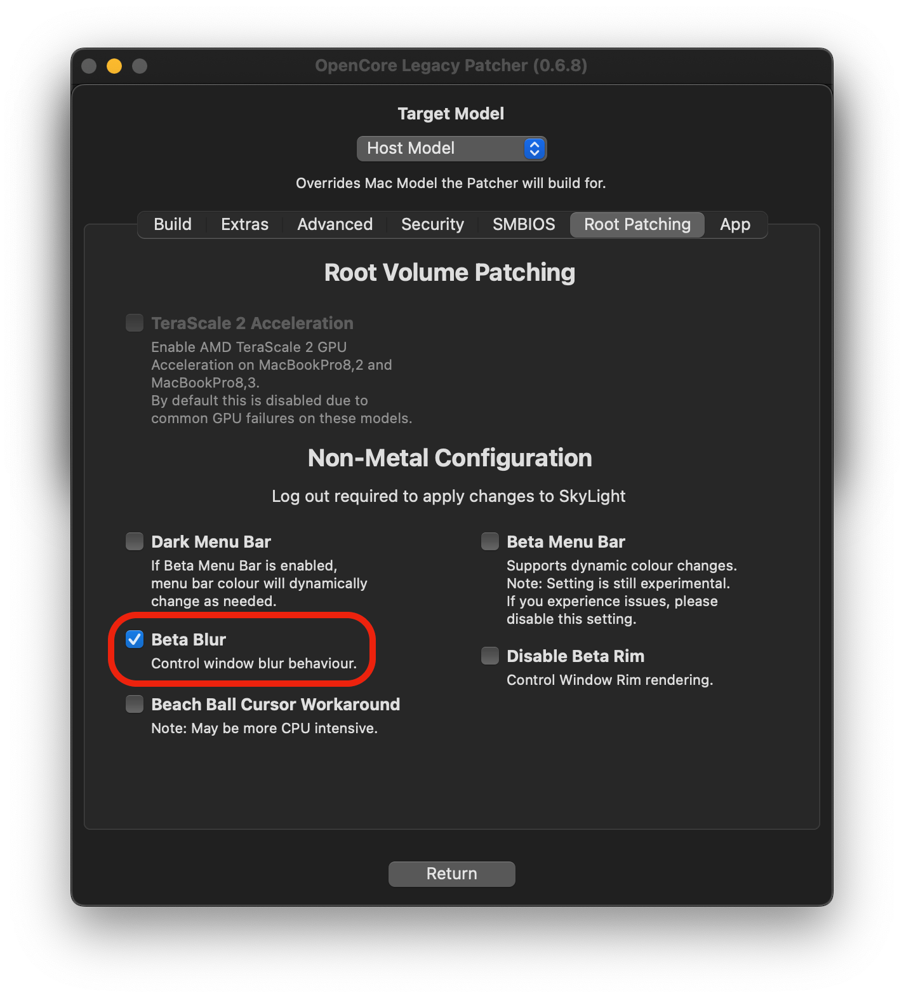

# Non-Metal issues

The below page is for users experiencing issues with their overall usage of macOS Big Sur and newer and the Legacy Graphics Acceleration patches. For those unfamiliar with what is considered a non-Metal GPU, see the chart in [FAQ](https://dortania.github.io/OpenCore-Legacy-Patcher/FAQ.html#what-is-metal-and-non-metal)

* [Broken Background Blurs](#broken-background-blurs)
* [Downloading older non-Metal Apps](#downloading-older-non-metal-apps)
* [Unable to run Zoom](#unable-to-run-zoom)
* [Unable to grant special permissions to apps (ie. Camera Access to Zoom)](#unable-to-grant-special-permissions-to-apps-ie-camera-access-to-zoom)
* [Photos and Maps app issues](#photos-and-maps-app-issues)
* [Cannot press "Done" when editing a Sidebar Widget](#cannot-press-done-when-editing-a-sidebar-widget)
* [Unable to allow Safari Extensions](#unable-to-allow-safari-extensions)

## Broken Background Blurs

By default with the non-Metal acceleration patches, many background blur menus may act distorted when moving a cursor over it. With 0.4.1 and newer, users can enable a new Beta Blur feature to try and resolve the issue:


<div align="left">
             
</div>

Do note that enabling beta blurs can be more demanding on slower hardware
## Downloading older non-Metal Apps

Many Apple apps now have direct reliance on Metal for proper functioning, however legacy builds of these apps still do work in Big Sur. See below for archive of many apps such as Pages, iMovie, GarageBand.

* [Apple Apps for Non-Metal Macs](https://archive.org/details/apple-apps-for-non-metal-macs)

Note: This archive assumes that you own these copies of these apps through the Mac App Store, Dortania does not condone piracy

## Unable to run Zoom

Currently Zoom relies partially on Metal and so needs a small binary patch. Dosdude1 has provided a nice script for this:

* [Zoom Non-Metal Fix](http://dosdude1.com/catalina/zoomnonmetal-new.command.zip)

## Unable to grant special permissions to apps (ie. Camera Access to Zoom)
Currently for Ventura 13.3 and newer, due to new patches required, permissions are yet again broken. Use TCCPlus in the Workaround dropdown to work around the issue.

This issue is fully resolved for 13.2.1 and lower starting from 0.2.5.

::: details Workaround for 0.2.4, Ventura 13.3+

Due to the usage of amfi_get_out_of_my_way=1, macOS will fail to prompt users for special permissions upon application start as well as omit the entries in System Preferences. To work around this, we recommend users install tccplus to manage permissions.

[Download TCCPlus](https://github.com/jslegendre/tccplus)

Example usage with Discord and microphone permissions:

```sh
# Open Terminal and run the following commands
cd ~/Downloads/
chmod +x tccplus
./tccplus add Microphone com.hnc.Discord
```

For those who may experience issues with `tccplus`, you can manually patch `com.apple.TCC` to add permissions:

```sh
# get app id (Zoom.us used in example):
$ osascript -e 'id of app "zoom.us"'
# output: us.zoom.xos

$ sudo sqlite3 ~/Library/Application\ Support/com.apple.TCC/TCC.db "INSERT or REPLACE INTO access VALUES('kTCCServiceMicrophone','us.zoom.xos',0,2,0,1,NULL,NULL,NULL,'UNUSED',NULL,0,1541440109);"

$ sudo sqlite3 ~/Library/Application\ Support/com.apple.TCC/TCC.db "INSERT or REPLACE INTO access VALUES('kTCCServiceCamera','us.zoom.xos',0,2,0,1,NULL,NULL,NULL,'UNUSED',NULL,0,1541440109);"
```

:::

## Photos and Maps app issues

**Starting from macOS Monterey, Maps and everything relying on it (such as Find My or 'Places' in Photos) are non-functional on non-Metal due to Metal reliance.**

::: details For Big Sur (click to expand)

Due to the Metal Backend, the enhanced color output of these apps seems to heavily break overall UI usage. To work around this, [users reported](https://forums.macrumors.com/threads/macos-11-big-sur-on-unsupported-macs-thread.2242172/post-29870324) forcing the color output of their monitor from Billions to Millions of colors helped greatly. Apps easily allowing this customization are [SwitchResX](https://www.madrau.com), [ResXreme](https://macdownload.informer.com/resxtreme/) and [EasyRes](http://easyresapp.com).

:::


## Cannot press "Done" when editing a Sidebar Widget

Workaround: Press some combination of Tab, or Tab and then Shift-Tab, or just Shift-Tab until the "Done" button is highlighted. Then press spacebar to activate the button, the same as in any other dialog with a highlighted button halo.


## Unable to allow Safari Extensions

Due to a bug in the legacy acceleration patches, users won't be able to enable Safari Extensions.

The following tool can be used to work-around this issue:

* [Non-Metal Safari Extensions](https://github.com/moosethegoose2213/Non-Metal-Safari-Extensions/)

