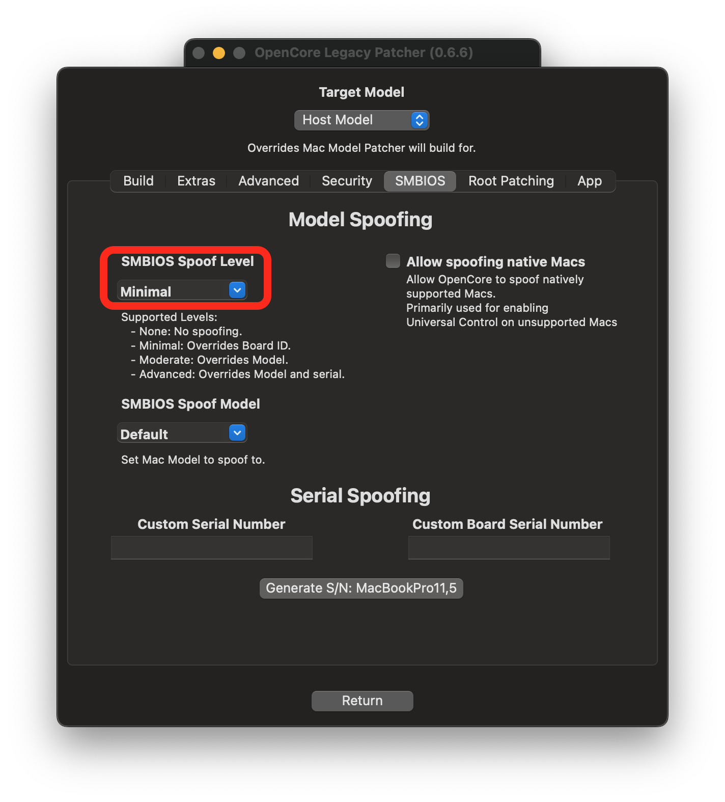

# Troubleshooting

Here are some common errors users may experience while using this patcher:

* [Stuck on `This version of Mac OS X is not supported on this platform`](#stuck-on-this-version-of-mac-os-x-is-not-supported-on-this-platform)
* [Cannot boot macOS without the USB](#cannot-boot-macos-without-the-usb)
* [Infinite Recovery OS Booting](#infinite-recovery-os-reboot)
* [Reboot when entering Hibernation (`Sleep Wake Failure`)](#reboot-when-entering-hibernation-sleep-wake-failure)
* [Booting with a non-flashed GPU](#booting-with-a-non-flashed-gpu)
* [How to Boot Big Sur Recovery](#how-to-boot-big-sur-recovery)
* [Stuck on "Your Mac needs a firmware update"](#stuck-on-your-mac-needs-a-firmware-update)
* [No Brightness Control](#no-brightness-control)
* [Cannot connect Wi-Fi on Monterey with legacy cards](#cannot-connect-Wi-Fi-on-Monterey-with-legacy-cards)
* [No Graphics Acceleration](#no-graphics-acceleration)
* [Black Screen on MacBookPro11,3 in macOS Monterey](#black-screen-on-macbookpro113-in-macos-monterey)
* [No DisplayPort Output on Mac Pros with NVIDIA Kepler](#no-displayport-output-on-mac-pros-with-NVIDIA-kepler)
* [Volume Hash Mismatch Error in macOS Monterey](#volume-hash-mismatch-error-in-macos-monterey)
* [Cannot Disable SIP in recoveryOS](#cannot-disable-sip-in-recoveryos)
* [Stuck on "Less than a minute remaining..."](#stuck-on-less-than-a-minute-remaining)


## Stuck on `This version of Mac OS X is not supported on this platform`

This means macOS has detected a SMBIOS it does not support, to resolve this ensure you're booting OpenCore **before** the macOS installer in the boot picker. Reminder the option will be called `EFI Boot`

Once you've booted OpenCore at least once, your hardware should now auto boot it until either NVRAM reset or you remove the drive with OpenCore installed.

## Cannot boot macOS without the USB

By default, the OpenCore Patcher won't install OpenCore onto the internal drive itself during installs. Instead, you'll need to either [manually transfer](https://dortania.github.io/OpenCore-Post-Install/universal/oc2hdd.html) OpenCore to the internal drive's EFI or run this patcher's Option 2 again but select your internal drive.

Reminder that once this is done, you'll need to select OpenCore in the boot picker again for your hardware to remember this entry and auto boot from then on.

## Infinite Recovery OS Booting

With OpenCore Legacy Patcher, we rely on Apple Secure Boot to ensure OS updates work correctly and reliably with Big Sur. However this installs NVRAM variables that will confuse your Mac if not running with OpenCore. To resolve, simply uninstall OpenCore and [reset NVRAM](https://support.apple.com/en-mide/HT201255).

* Note: Machines with modded root volumes will also result in infinite recovery until integrity is restored

## Reboot when entering Hibernation (`Sleep Wake Failure`)

[Known issue on some models](https://github.com/dortania/Opencore-Legacy-Patcher/issues/72), temporary fix is to disable Hibernation:

```
sudo pmset -a hibernatemode 0
```

## Booting with a non-flashed GPU

For Mac Pro, Xserve and iMac users with non-flashed GPUs, you can still easily boot OpenCore and view the entire boot process. To do so, make sure SIP is disabled(to allow NVRAM write access) and run the following:

```sh
sudo bless --verbose --file /Volumes/VOLNAME/EFI/OC/OpenCore.efi --folder /Volumes/VOLNAME/EFI/OC --setBoot
```

* Note you will need to replace `VOLNAME` with the Volume name of your USB or hard drive with OpenCore
* Note 2: Once done, you can re-enable SIP
* Note 3: The EFI partition OpenCore was installed on must be mounted, if it's unmounted simply rerun "Install OpenCore to drive"

Once you boot OpenCore for the first time, LauncherOption will install itself as the top boot priority making OpenCore always launch. Combined with `RequestBootVar`, all boot options must go through OpenCore ensuring seamless usage even with OS installation and updates.

## How to Boot Big Sur Recovery

By default, the patcher will try to hide extra boot options such as recovery from the user. To make them appear, simply press the "Spacebar" inside OpenCore's Picker to list all boot options.

## Stuck on "Your Mac needs a firmware update"

Full error: "Your Mac needs a firmware update in order to install to this Volume. Please select a Mac OS Extended (Journaled) volume instead."

This error occurs when macOS determines the firmware to not have full APFS support. To resolve is quite simple, when building OpenCore head to "Patcher Settings" and enable "Moderate SMBIOS Patching" or higher. This will ensure that the firmware reported will show as supporting full APFS capabilities.

## No Brightness Control

With OCLP v0.0.22, we've added support for brightness control on many models. However some users may have noticed that their brightness keys do not work.

To work-around, we recommend user try out the below app:

* [Brightness Slider](https://actproductions.net/free-apps/brightness-slider/)

## Cannot connect Wi-Fi on Monterey with legacy cards

With OCLP v0.2.5, we've added support for legacy Wi-Fi on Monterey. However some users may have noticed that they can't connect to wireless networks.

To work-around, we recommend users to manually connect using the "other" option on the Wi-Fi menu bar or manually adding the network on the "Network" preference pane.

## No Graphics Acceleration


In macOS, each release generally means GPU drivers are dropped from the OS. With macOS Big Sur, currently all non-Metal GPUs require additional patches to gain acceleration. In addition, macOS Monterey removed Graphics Drivers for both Intel Ivy Bridge and NVIDIA Kepler. 

If you're using OCLP v0.4.4, you should have been prompted to install Root Volume patches after first boot from installation of macOS. If you need to do this manually, you can within our app. Once rebooted, acceleration will be re-enabled as well as brightness control for laptops.

## Black Screen on MacBookPro11,3 in macOS Monterey

Due to Apple dropping NVIDIA Kepler support in macOS Monterey, [MacBookPro11,3's GMUX has difficulties switching back to the iGPU to display macOS correctly.](https://github.com/dortania/OpenCore-Legacy-Patcher/issues/522) To work-around this issue, boot the MacBookPro11,3 in Safe Mode and once macOS is installed, run OCLP's Post Install Root Patches to enable GPU Acceleration for the NVIDIA dGPU.

* Safe Mode can be started by holding Shift+Enter when selecting macOS Monterey in OCLP's Boot Menu.

## No DisplayPort Output on Mac Pros with NVIDIA Kepler

If you're having troubles with DisplayPort output on Mac Pros, try enabling Minimal Spoofing in Settings -> SMBIOS Settings and rebuild/install OpenCore. This will trick macOS drivers into thinking you have a newer MacPro7,1 and play nicer.



## Volume Hash Mismatch Error in macOS Monterey

A semi-common popup some users face is the "Volume Hash Mismatch" error:

<p align="center">

</p>

What this error signifies is that the OS detects the boot volume's hash does not match to what the OS detects, this error is generally cosmetic and can be ignored. However if your system starts to crash spontaneously shortly after, you'll want to reinstall macOS fresh without importing any data at first.

* Note that this bug affects native Macs as well and is not due to issues with unsupported Macs: [OSX Daily: “Volume Hash Mismatch” Error in MacOS Monterey](https://osxdaily.com/2021/11/10/volume-hash-mismatch-error-in-macos-monterey/)

Additionally it can help to disable FeatureUnlock in Settings -> Misc Settings as this tool can be strenuous on systems with weaker memory stability.

## Cannot Disable SIP in recoveryOS

With OCLP, the patcher will always overwrite the current SIP value on boot to ensure that users don't brick an installation after NVRAM reset. However for users wanting to disable SIP entirely, this can be done easily.

Head into the GUI, Patcher Settings and toggle the bits you need disabled from SIP:

| SIP Enabled | SIP Lowered (Root Patching) | SIP Disabled |
| :--- | :--- | :--- |
|  |  |  |

## Intermediate issues with USB 1.1 and Bluetooth on MacPro3,1 - MacPro5,1

For those experiencing issues with USB 1.1 devices (such as mice, keyboards and bluetooth chipsets), macOS Big Sur and newer have weakened OS-side reliability for the UHCI controller in older Mac Pros.

* UHCI is a USB 1.1 controller that is hooked together with the USB 2.0 ports in your system. Whenever a USB 1.1 device is detected, the UHCI controller is given ownership of the device at a hardware/firmware level.
  * EHCI is the USB 2.0 controller in older Mac Pros

Because of this, we recommend placing a USB 2.0/3.0 hub between your devices and the port on the Mac Pro. UHCI and EHCI cannot both be used at once, so using a USB hub will always force the EHCI controller on.

* Alternatively, you can try cold starting the hardware and see if macOS recognizes the UHCI controller properly

## Stuck on "Less than a minute remaining..."

A common area for systems to get "stuck", namely for units that are missing the `AES` CPU instruction/older mobile hardware. During this stange a lot of heavy cryptography is performed, which can make systems appear to be stuck when in reality they are working quite hard to finish up the installation. 

Because this step can take a few hours or more depending on drive speeds, be patient at this stage and do not manually reboot your machine as this will break the installation and require you to reinstall. If you think your system has stalled, press the Caps Lock key. If the light turns on, your system is busy.
