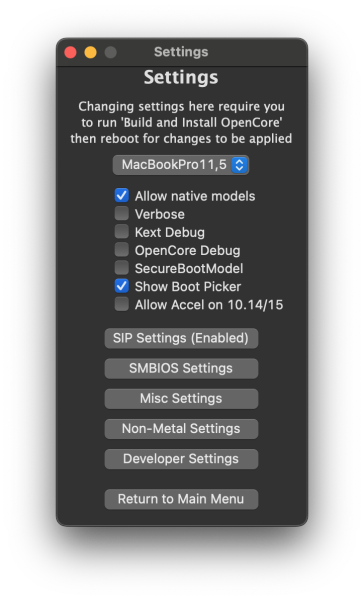
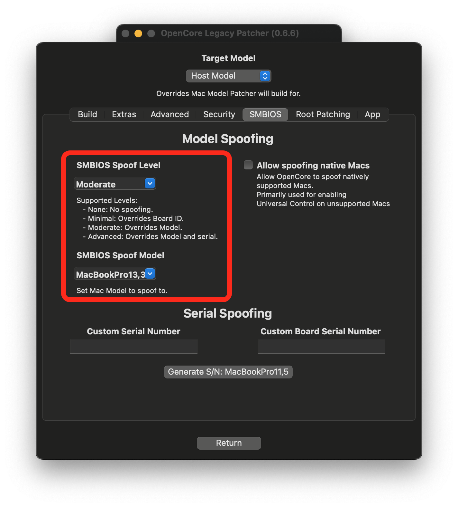

# Universal Control on unsupported Macs

Introduced in macOS 12 Monterey, Universal Control is a feature that allows a Mac to control other Macs and/or iPads, share input devices, and share files across them simultaneously. With OpenCore and FeatureUnlock, Universal Control can be unlocked for most unsupported Macs, so long as they meet the technical requirements.

* Note: Following page is primarily for hobbiests, no proper support is provided outside of Discord support (see bottom of page)

## Enabling Universal Control

If you meet all the requirements, in most cases you can go to Display Preferences and tick the Universal Control settings to enable it. If you're planning to use Universal Control with an iPad, make sure to enable Universal Control on the iPad as well.

| Display Preferences | Universal Control settings |
| :--- | :--- |
|  |  |

Most Macs 2011 and above should work out of the box. However, older Macs like 2008-2011 MacBook Pro's require upgrading to a newer Wi-Fi/Bluetooth card. More info in the [requirements section.](#requirements-for-universal-control)

Some Monterey-native models are blacklisted, check the [blacklisted models section](#blacklisted-models) for more info.

## Requirements for Universal Control

Technical requirements:

* Wi-Fi 4 (802.11n)
* Bluetooth 4.0
* macOS Monterey 12.4 or newer
* iPadOS 15.4 or newer (if applicable)
* OpenCore Legacy Patcher 0.4.3 or newer

Check the [table of models](#table-of-models) below whether you need to upgrade hardware and exactly what hardware is required to be changed based on the offending Macs. Refer for help on how to upgrade the Wi-Fi card on older 2008-2011 models on the Discord channel [#hardware](https://discord.gg/rqdPgH8xSN) if required.

Other requirements:

* All devices signed into the same iCloud account.
* Two Factor Authentication enabled with your Apple ID.
* Bluetooth and WiFi enabled, neither needs to be connected so long as they are enabled.
* Handoff turned on from iCloud settings.
* The devices in question to be in close proximity.

### Table of models

This table shows which models do and don't support Universal Control out of box (OOB) and what is required to gain support.

::: details MacBook

|   SMBIOS   | WiFi/BT version | UC OOB  | Comment |
|------------|-----------------|------------|---------|
| MacBook4,1 | Wi-Fi 4 / BT 2.0 EDR |   NO  | Use the Mac Pro Wi-Fi upgrade kit to upgrade to BCM94360 |
| MacBook5,1 | ^^ |  ^^ | ^^ |
| MacBook5,2 | WiFi 4 / BT 2.1 EDR  | ^^ | ^^ |
| MacBook6,1 | ^^ | ^^ | Upgrade to BCM94360 |
| MacBook7,1 | ^^ | ^^ | ^^ |
| MacBook8,1 | WiFi 5 + BT 4.0 |  YES  | Universal Control will work. |

:::

::: details MacBook Air

| SMBIOS | WiFi/BT version | UC OOB  | Comment |
|--------|-----------------|------------|---------|
| MacBookAir2,1 | Wi-Fi 4 / BT 2.1 EDR |  NO  | Replace the card with BCM94360 and disconnect/disable the BT module. |
| MacBookAir3,1 | ^^ | ^^ | ^^ |
| MacBookAir3,2 | ^^ | ^^ | ^^ |
| MacBookAir4,1 | Wi-Fi 4 +  BT 4.0 |  YES  | Universal Control will work. |
| MacBookAir4,2 | ^^ | ^^ | ^^ |
| MacBookAir5,1 | ^^ | ^^ | ^^ |
| MacBookAir5,2 | ^^ | ^^ | ^^ |
| MacBookAir6,1 | Wi-Fi 5 + BT 4.0 | ^^ | ^^ |
| MacBookAir6,2 | ^^ | ^^ | ^^ |
| MacBookAir7,1 | ^^ |  NO  | Hardware supports UC.   [**Spoofing required.**](#blacklisted-models)|
| MacBookAir7,2 | ^^ | ^^ | ^^ |

:::

::: details MacBook Pro

| SMBIOS | WiFi/BT version | UC OOB   | Comment |
|--------|-----------------|-------------|---------|
| MacBookPro4,1 | Wi-Fi 4   /   BT 2.1 EDR |  NO  | Use the Mac Pro Wi-Fi upgrade kit to upgrade to BCM94360 |
| MacBookPro5,1 | ^^ | ^^ | Upgrading to BCM94331 requires some heavy case hardware modifications, so instead use a USB BT 4.0 dongle |
| MacBookPro5,2 | ^^ | ^^ | ^^ |
| MacBookPro5,3 | ^^ | ^^ | ^^ |
| MacBookPro5,4 | ^^ | ^^ | ^^ |
| MacBookPro5,5 | ^^ | ^^ | ^^ |
| MacBookPro6,1 | ^^ | ^^ | ^^ |
| MacBookPro6,2 | ^^ | ^^ | ^^ |
| MacBookPro7,1 | ^^ | ^^ | ^^ |
| MacBookPro8,1 | Wi-Fi 4 + BT 2.1 EDR | ^^ | Upgrade to BCM94331 |
| MacBookPro8,2 | ^^ | ^^ | ^^ |
| MacBookPro9,1 | Wi-Fi 4 + BT 4.0 |  YES  | Universal Control will work. |
| MacBookPro9,2 | ^^ | ^^ | ^^ |
| MacBookPro10,1 | ^^ | ^^ | ^^ |
| MacBookPro10,2 | ^^ | ^^ | ^^ |
| MacBookPro11,1 | Wi-Fi 5 + BT 4.0 | ^^ | ^^ |
| MacBookPro11,2 | ^^ | ^^ | ^^ |
| MacBookPro11,3 | ^^ | ^^ | ^^ |
| MacBookPro11,4 | Wi-Fi 5 + BT 4.2 |  NO  | Hardware supports UC.   [**Spoofing required.**](#blacklisted-models) |
| MacBookPro11,5 | ^^ | ^^ | ^^ |
| MacBookPro12,1 | ^^ | ^^ | ^^ |
:::

:::details Mac mini

| SMBIOS | WiFi/BT version | UC OOB | Comment |
|--------|-----------------|------------|---------|
| Macmini3,1 | Wi-Fi 4 + BT 2.1 EDR  |   NO   | Upgrade requires some heavy electrical and case modifications, so instead used a USB BT 4.0 dongle. |
| Macmini4,1 | ^^ |  ^^ | Upgrade to BCM94360. |
| Macmini5,1 | Wi-Fi 4 + BT 4.0 |  YES  | Universal Control will work. |
| Macmini5,2 | ^^ | ^^ | ^^ |
| Macmini5,3 | ^^ | ^^ | ^^ |
| Macmini6,1 | ^^ | ^^ | ^^ |
| Macmini6,2 | ^^ | ^^ | ^^ |
| Macmini7,1 | Wi-Fi 5 + BT 4.0 |  NO  | Hardware supports UC.   [**Spoofing required.**](#blacklisted-models) |

::: 

:::details iMac

|  SMBIOS  | WiFi/BT version | UC OOB | Comment |
|----------|-----------------|------------|---------|
| iMac7,1  | Wi-Fi 4 + BT 2.0 EDR  |  NO  | Use the Mac Pro Wi-Fi upgrade kit to upgrade to BCM94360 (soldering required for BT)
| iMac8,1  | ^^ | ^^ | ^^ |
| iMac9,1  | Wi-Fi 4 / BT 2.1 EDR  | ^^ | ^^ |
| iMac10,1 | ^^ | ^^ | ^^ |
| iMac11,1 | ^^ | ^^ | ^^ |
| iMac11,2 | ^^ | ^^ | ^^ |
| iMac11,3 | ^^ | ^^ | ^^ |
| iMac12,1 | ^^ | ^^ | ^^ |
| iMac12,2 | ^^ | ^^ | ^^ |
| iMac13,1 | Wi-Fi 4 + BT 4.0 |  YES  | Universal Control will work. |
| iMac13,2 | ^^ | ^^ | ^^ |
| iMac13,3 | ^^ | ^^ | ^^ |
| iMac14,1 | Wi-Fi 5 + BT 4.0 | ^^ | ^^ |
| iMac14,2 | ^^ | ^^ | ^^ |
| iMac14,3 | ^^ | ^^ | ^^ |
| iMac14,4 | ^^ | ^^ | ^^ |
| iMac15,1 | ^^ | ^^ | ^^ |
| iMac16,1 | Wi-Fi 5 + BT 4.2 |  NO  | Hardware supports UC.   [**Spoofing required.**](#blacklisted-models) |
| iMac16,2 | ^^ | ^^ | ^^ |

::: 

:::details Mac Pro

| SMBIOS    | WiFi/BT version | UC OOB  | Comment |
|-----------|-----------------|---------|---------|
| MacPro3,1 | Wi-Fi 4 + BT 2.0 EDR |  NO  | Use the Mac Pro Wi-Fi upgrade kit to upgrade to BCM94360. |
| MacPro4,1 | Wi-Fi 4 + BT 2.1 EDR | ^^ | Use the Mac Pro Wi-Fi upgrade kit to upgrade to BCM94360 (soldering required for BT) |
| MacPro5,1 | ^^ | ^^ | ^^ |
| MacPro6,1 | Wi-Fi 5 + BT 4.0 | ^^ | Hardware supports UC.   [**Spoofing required.**](#blacklisted-models) |

* Note: Some older Mac Pro configurations may not have shipped with a WiFi card in the base model

::: 
## Blacklisted models

The following models are blacklisted from using Universal Control by Apple:

- MacBookAir7,x - MacBook Air Early 2015 11" / 13"
- MacBookPro11,4 - MacBook Pro Mid 2015 15" (Intel Iris)
- MacBookPro11,5 - MacBook Pro Mid 2015 15" (dGPU)
- MacBookPro12,x - MacBook Pro Early 2015 13"
- iMac16,x - iMac Late 2015 21"
- Macmini7,x - Mac mini 2014
- MacPro6,x - Mac Pro Late 2013

The hardware in these models is capable but due to blacklisting, the only solution to use Universal Control on the models above is to spoof their SMBIOS. SMBIOS spoofing essentially fools some aspects of macOS to think they are running on a different machine. 

With SMBIOS Spoofing, the Universal Control handshake recognizes a different SMBIOS and thus grants a blacklisted Mac to connect to other iPads and Macs with Universal Control.

| Situation | Condition | Solution |
|-----------|-----------|---------|
| Mac <-> Mac connection | Monterey-unsupported | No spoofing needed |
| Mac <-> iPad connection | Monterey-unsupported | No spoofing needed |
| Mac <-> Mac connection | One or both are blacklisted |Spoofing required on blacklisted Macs |
| Mac <-> iPad connection | Blacklisted Mac | Spoofing required on blacklisted Mac |

:::warning

Before we continue, please keep in mind SMBIOS Spoofing is an advanced feature of OpenCore, that with reckless usage of it, could potentially screw things around and leave your installation non-working. Once you boot into a spoofed state, it is highly recommended you stay spoofed, and avoid booting macOS without OpenCore.

:::

### How to spoof

Firstly, run the GUI version of OpenCore Legacy Patcher, go to **Settings** and tick **Allow native models**.

**Note:** Unless you are building OpenCore on a different machine than it's targeted for, **do not** change the model in this main settings view. It is important to understand that OCLP targets this model regardless of what you may have spoofed to, as your Mac is still what the Native SMBIOS shows.

Secondly, go to **SMBIOS Settings**, tick **Allow Native Spoofs**, set SMBIOS Spoof Level to **Moderate**. Set SMBIOS Spoof Model to **one next to your native model in the table for spoofed models below.**

::: details Table for spoofed models (click to expand)

Any model after the list of officially blacklisted Macs should be supported, but these are the earliest Macs with Universal Control support, and thus chosen for the sake of simplicity.

**Reminder:** Macs that are not listed on this table work without spoofing, including systems that do not natively support Monterey as long as the other requirements are met, since they aren't blacklisted.

| Mac by name | Native SMBIOS | Spoof SMBIOS | Tested | Tested by |
|-------------|---------------|--------------|--------|-----------|
| MacBook Air Early 2015 11" / 13" | MacBookAir7,x | MacBookAir8,1 |  YES  | Hzlph |
| MacBook Pro Early 2015 13" | MacBookPro12,x | MacBookPro13,1 | ^^ | ^^ |
| MacBook Pro Mid 2015 15" | MacBookPro11,4 / 11,5 | MacBookPro13,3 | ^^ | ^^ 
| iMac Late 2015 21" | iMac16,x | iMac18,2 | ^^ | ^^ 
| Mac mini Late 2014  | Macmini7,x | MacMini8,1 |  NO  | N/A |
| Mac Pro Late 2013 | MacPro6,x | MacPro7,1 |  YES  | Crystall1nedev |

:::

| Main Settings view | SMBIOS settings |
| :--- | :--- |
|  |  |

Build and install OpenCore again, reboot back to the OS. Enable Universal Control as explained in [Enabling Universal Control section.](#enabling-universal-control)

You should now be prompted to log back into iCloud by your Mac. This means you were successful, otherwise, verify you are correctly following the steps listed above, or else ask on the Discord group for assistance on [#misc-help](https://discord.gg/rqdPgH8xSN).
