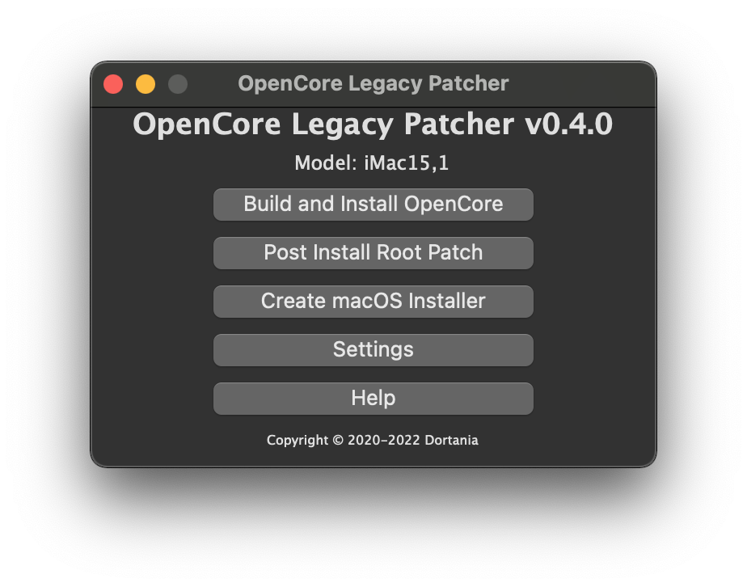
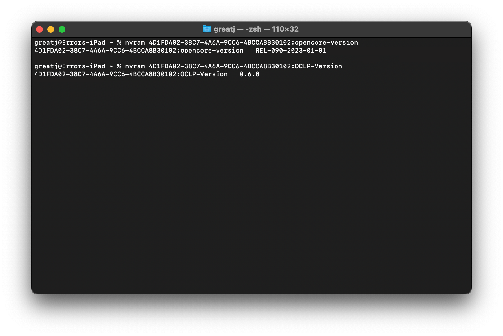

# Updating OpenCore and Patches

With OpenCore Legacy Patcher, there's generally very little reason for users to update the OpenCore installation on their machine unless you feel there's a benefit with new versions for your setup, e.g. Bluetooth has stopped working with a new macOS update. 

For those who do wish to update, simply [download the latest release](https://github.com/dortania/OpenCore-Legacy-Patcher/releases) and rerun the patcher:



Then, rebuild your OpenCore build and install again. OpenCore Will now be updated!

To check what version of OpenCore and the Patcher you're currently running, you can run the following in the terminal:

```bash
# OpenCore Version
nvram 4D1FDA02-38C7-4A6A-9CC6-4BCCA8B30102:opencore-version
# Patcher Version
nvram 4D1FDA02-38C7-4A6A-9CC6-4BCCA8B30102:OCLP-Version
```



From this, we can see that we're running a RELEASE version of OpenCore 0.6.8 built on March 27th, 2021 with Patcher Version 0.0.20!
