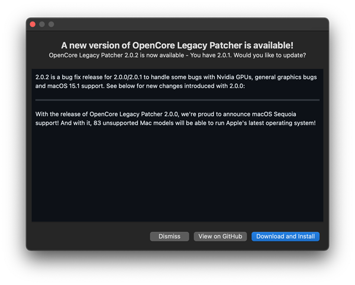
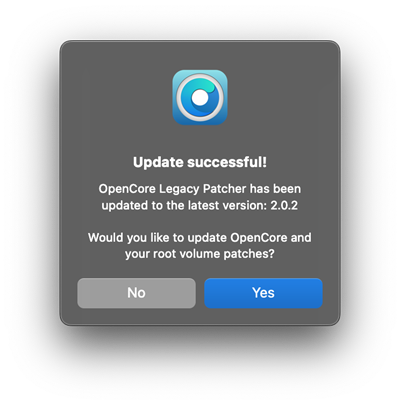

# Updating OpenCore and Patches

This guide explains how to get fully up to date application, bootloader and patches.

## Updating the application

Latest versions of OCLP can download updates by themselves, you will get notified of a new update with the changelog.

[You can also manually download the latest release here.](https://github.com/dortania/OpenCore-Legacy-Patcher/releases)


<div align="left">
             
</div>


## Updating patches

After the update, the application asks if you want to update OpenCore and root patches. 

If you do not need to change any settings, you can click "Yes" and follow the procedure. If you want to change settings, select "No" from here and do your settings, then manually build and install OpenCore to update to the latest version of the bootloader.

Finally install new root patches to ensure you're running on the latest fixes for on-disk patches. 


<div align="left">
             
</div>

## Checking OCLP and OpenCore versions

To check what version of OpenCore bootloader and the Patcher you're currently running, you can run the following in the terminal:

```bash
# OpenCore Version
nvram 4D1FDA02-38C7-4A6A-9CC6-4BCCA8B30102:opencore-version
# Patcher Version
nvram 4D1FDA02-38C7-4A6A-9CC6-4BCCA8B30102:OCLP-Version
```

<div align="left">
             
</div>

From this, we can see that we're running a RELEASE version of OpenCore 0.9.0 built on January 1st, 2023 with Patcher Version 0.6.0!
