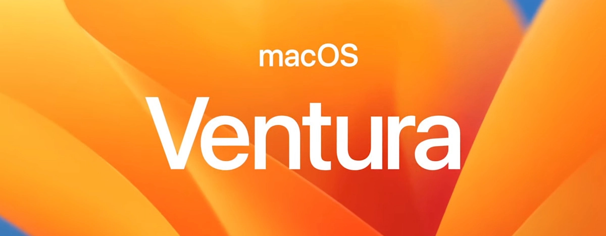
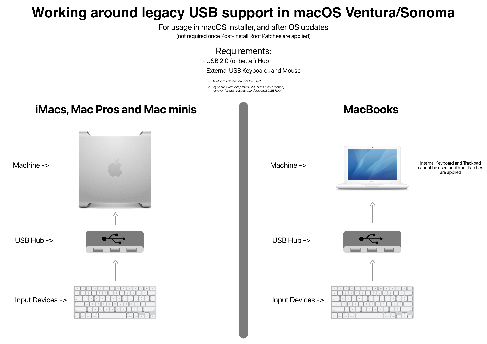

# macOS Ventura

With the release of OpenCore Legacy Patcher v0.5.0 and newer, early support for macOS Ventura has been implemented for most Metal-capable Macs. This page will be used to inform users regarding current issues and will be updated as new patch sets are developed and added to our patcher.

## Newly dropped hardware

Ventura's release dropped a large amount of Intel hardware, thus requiring the usage of OpenCore Legacy Patcher on the following models (in addition to previously removed models):

* iMac16,1 (21.5-inch, Late 2015)
* iMac16,2 (21.5-inch and 21.5-inch 4K, Late 2015)
* iMac17,1 (27-inch 5K, Late 2015)
* MacBook9,1 (12-inch, Early 2016)
* MacBookAir7,1 (11-inch, Early 2015)
* MacBookAir7,2 (13-inch, Early 2015)
* MacBookPro11,4 (15-inch, Mid 2015, iGPU)
* MacBookPro11,5 (15-inch, Mid 2015, dGPU)
* MacBookPro12,1 (13-inch, Early 2015)
* MacBookPro13,1 (13-inch, Late 2016)
* MacBookPro13,2 (13-inch, Late 2016)
* MacBookPro13,3 (15-inch, Late 2016)
* Macmini7,1 (Late 2014)
* MacPro6,1 (Late 2013)

## Current status

For older hardware, see below sections:

* [Currently Unsupported/Broken Hardware in Ventura](#currently-unsupportedbroken-hardware-in-ventura)
  * [AMD Polaris, Vega and Navi support on pre-2019 Mac Pros and pre-2012 iMacs](#amd-polaris-vega-and-navi-support-on-pre-2019-mac-pros-and-pre-2012-imacs)
  * [USB 1.1 (OHCI/UHCI) Support](#usb-11-ohciuhci-support)
  * [Ethernet issue with Early 2008 Mac Pro](#ethernet-issue-with-early-2008-mac-pro)

The team is doing their best to investigate and fix the aforementioned issues, however no estimated time can be provided.

## Currently Unsupported/Broken Hardware in Ventura

### AMD Polaris, Vega and Navi support on pre-2019 Mac Pros and pre-2012 iMacs

For users with 2008 to 2013 Mac Pros (MacPro3,1-6,1) and 2009 to 2011 iMacs (iMac9,1-12,2), keep in mind that macOS Ventura now requires [AVX2.0 support in the CPU](https://en.wikipedia.org/wiki/Advanced_Vector_Extensions#Advanced_Vector_Extensions_2) for native graphics acceleration. Thus while your GPU may be natively supported, you cannot run Ventura officially with these GPUs.

* CPUs supporting AVX2.0 are Haswell or newer, which no pre-2019 Mac Pros can be upgraded with.

Currently at this time, OpenCore Legacy Patcher only supports patching the AMD Polaris and Vega Graphics stack to no longer require AVX2.0. We're recently received an AMD RX 6600 donation, so hopefully in the future the project can support AMD Navi with pre-Haswell Macs. However, no time estimates can be given.

Following GPUs are applicable:

| GPU Architecture | Model Families | Supported |
| :--- | :--- | :--- |
| AMD Polaris | RX 4xx/5xx (10/20 series) |  Supported with patching  |
| AMD Vega    | Vega 56/64/VII (10/20 series) | ^^ |
| AMD Navi    | RX 5xxx/6xxx (10/20 series) |  Unsupported  |

### USB 1.1 (OHCI/UHCI) Support

For Penryn systems and pre-2013 Mac Pros, USB 1.1 support was outright removed in macOS Ventura. While USB 1.1 may seem unimportant, it handles many important devices on your system. These include:

* Keyboard and Trackpad for laptops
* IR Receivers
* Bluetooth

With OpenCore Legacy Patcher v0.6.0, basic support has been implemented via Root Volume patching. However due to this, users will need to use a USB hub for installation and post-OS updates when patches are cleaned:

::: warning The following systems rely on USB 1.1

* iMac10,x and older
* Macmini3,1 and older
* MacBook7,1 and older
* MacBookAir3,1 and older
* MacBookPro7,1 and older
  * MacBookPro6,x is exempt
* MacPro5,1 and older

:::

::: details Legacy Wireless Support (Resolved in v0.6.0 and newer)

### Legacy Wireless Support

For systems that required Root Patches in macOS Monterey to achieve Wireless support, unfortunately macOS Ventura has broken the patch set. Currently the following Wifi cards are unsupported:

* Atheros: All models
* Broadcom: BCM94328 and BCM94322

The following machines shipped stock with these cards:

* iMac12,x and older
* Macmini3,1 and older
* MacBook5,x and older
* MacBookAir2,1 and older
* MacBookPro7,1 and older
  * MacBookPro6,x is exempt
* MacPro5,1 and older

Currently BCM943224, BCM94331, BCM94360 and BCM943602 are still fully supported by OpenCore Legacy Patcher. Consider upgrading to these cards if possible.

:::

::: details Non-Metal Graphics Acceleration (Resolved in v0.6.0 and newer)

### Non-Metal Graphics Acceleration

Regarding non-Metal, the team is hard at work to get non-Metal working, however this is our greatest challenge since Big Sur.

Apple has made significant changes to the graphics stack in order to facilitate fancy effects, and in particularly, Stage Manager. We will update you as we work on development, however, now is not the best time to ask about ETAs.

The following GPUs are applicable:

* NVIDIA:
  * Tesla (8000 - 300 series)
* AMD:
  * TeraScale (2000 - 6000 series)
* Intel:
  * Iron Lake
  * Sandy Bridge (2000 - 3000 series)

The following machines shipped stock with an unsupported GPU:

* iMac7,1 - iMac12,x
* MacBook5,1 - MacBook7,1
* MacBookAir2,1 - MacBookAir4,x
* MacBookPro4,1 - MacBookPro8,x
* Macmini3,1 - Macmini5,x
* MacPro3,1 - MacPro5,1
* Xserve2,1 - Xserve3,1

:::
