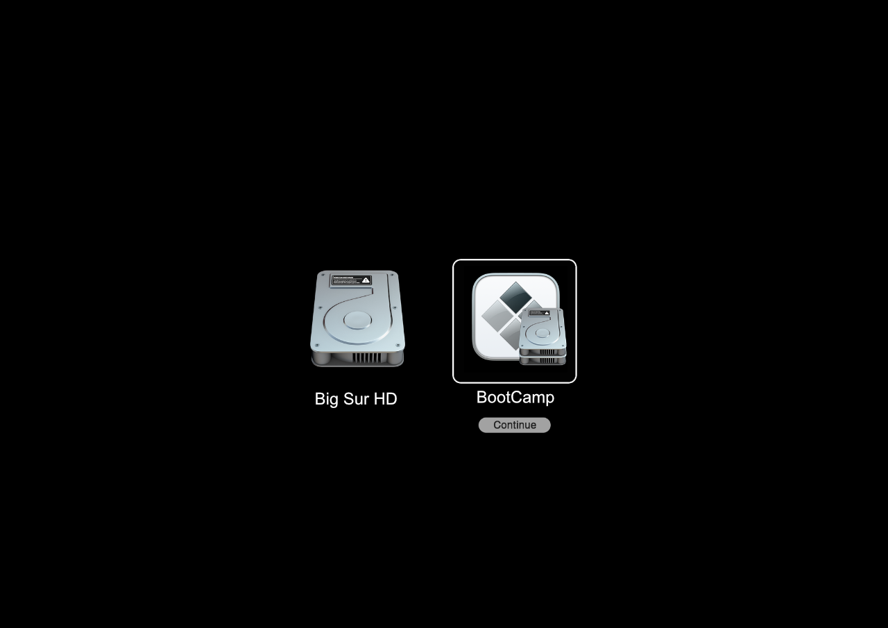

# Installing UEFI Windows 10

* Guide based off of [cdf's Mac Pro Thread](https://forums.macrumors.com/threads/opencore-on-the-mac-pro.2207814/)

To install a UEFI copy of Windows is actually super simple! All it requires is to boot Windows' Installer through OpenCore to force a UEFI setup. Here we'll be going step by step in the process, including partitioning and such.

* Note: UEFI Windows is generally quite usable for Arrandale and newer models, however machines with Penryn CPUs may experience issues
* Recommended Models:
  * MacBookAir4,x - 5,x
  * MacBookPro8,x - 10,x
  * Macmini5,x - 6,x
  * iMac11,x - 13,x

Once you know if your model is supported, you're good to go with the rest of this guide.

* Newer models than listed here will already natively support UEFI Windows through Boot Camp.

For MacPro4,1/5,1 and Xserve3,1 users, please be aware that Windows has troubles with automatic installation, so please refer to cdf's guide on manual installation:

* [cdf's Mac Pro Thread](https://forums.macrumors.com/threads/opencore-on-the-mac-pro.2207814/)

## Disk Formatting

To start off, we'll need the following:

* An 8GB USB drive for the Windows Installer
* A minimum of 30GB of free space on whichever drive you want to install Windows to

First, let's format our drives with the following steps:

### USB Drive Formatting

Open Disk Utility in macOS and format the USB Drive as ExFat with the Master Boot Record scheme:


### Disk Formatting

Next, grab the drive you wish to install Windows on and partition it as ExFat (If formatting the entire drive, ensure it's using the GUID Partition Table scheme):


If you plan to use the same hard drive for macOS and Windows, we recommend creating a dedicated partition just for OpenCore. This lets Windows have the ESP to itself and OpenCore can stay within it's own bubble.

Recommended size is 200MB and the partition format **must** be FAT32 for OpenCore to operate correctly. You will next want to install OpenCore onto the new partition, either moving from the ESP with [MountEFI](https://github.com/corpnewt/MountEFI) or rerunning the OpenCore-Patcher.app

* Note 1: For machines with dedicated drives for Windows, having different partitions for OpenCore is not required.
* Note 2: We recommend uninstalling OpenCore from the ESP/EFI Partition when you create this new OpenCore partition to avoid confusion when selecting OpenCore builds in the Mac's boot picker.


## Creating the Installer

First up, lets grab Windows's Installer at the below link:

* [Download Windows 10 Disc Image (ISO File)](https://www.microsoft.com/en-ca/software-download/windows10ISO)

Next, mount the Windows 10 ISO:


Then open terminal and run `rsync` on the USB drive (replace CCCOMA_X64 with the mounted ISO's name, as well as replacing W10USB with your USB drive's name):

```
rsync -r -P /Volumes/CCCOMA_X64/ /Volumes/W10USB
```

::: details If you get an error about install.wim

One of the files, `install.wim`, may be too big for the FAT32 file system to hold. If this is the case, you should enter the commands below rather than the one above. This assumes you have `wimlib` installed, if not you can install it with [Homebrew](https://brew.sh):

```
# Copy everything but the install.wim file
rsync -vha -P --exclude=sources/install.wim /Volumes/CCCOMA_X64/ /Volumes/W10USB

# Use wimlib to split the install.wim file into a size that fits
wimlib-imagex split /Volumes/CCCOMA_X64/sources/install.wim /Volumes/W10USB/sources/install.swm 4000
```

Once that's completed, you can continue.
:::


Command will take some time, so sit back and get some coffee. Once finished, the root of the USB drive should look as follows:

* Ensure that these folders and files are in the root of the USB drive, otherwise the USB will not boot.


Once done, lets reboot into OpenCore's Menu and you'll see a new Windows' entry:

* Note: Do not boot the installer outside of OpenCore as this will default back to the old MBR BIOS setup. Booting through OpenCore ensures Windows uses UEFI.


From there, install Windows as normal and you'll get a new BootCamp entry in OpenCore's picker when done! Don't forget to run BootCamp's utilities installer as well to ensure Wi-Fi and other important features are functioning correctly. This can be downloaded from the BootCamp Assistant app in macOS, or with [brigadier](https://github.com/timsutton/brigadier) in Windows.



## Troubleshooting

### "This version of Boot Camp is not intended for this computer model."

If you built OpenCore with Moderate or higher SMBIOS spoofing, you'll get an error when trying to install Boot Camp drivers. You can solve this by either rebuilding OpenCore with a lower spoof level, or running the installer from `Drivers/Apple/BootCamp.msi`.

| Setup.exe | BootCamp.msi |
| :--- | :--- |
|  |  |

::: details BootCamp.msi quirks

If needed, you can run it from the command line as administrator:

```
set __COMPAT_LAYER=WIN7RTM && start \path\to\BootCamp\Drivers\Apple\Bootcamp.msi'
```

Make sure to substitute `\path\to` with the location of the BootCamp folder.

You can also open `Properties` on the file to change the compatibility to `Previous version of Windows` in case you have BootCamp 4.0 drivers (the above command does this already.)

:::

### iMac12,x Bluescreen after driver installation

Currently Intel's iGPU drivers for the HD 3000 series do not support UEFI booting in Windows. The recommended solution is to simply disable the iGPU: [iMac 12,1 Windows 10 Boot Loop – Fix Intel Graphics issue](https://zzq.org/?p=39)
