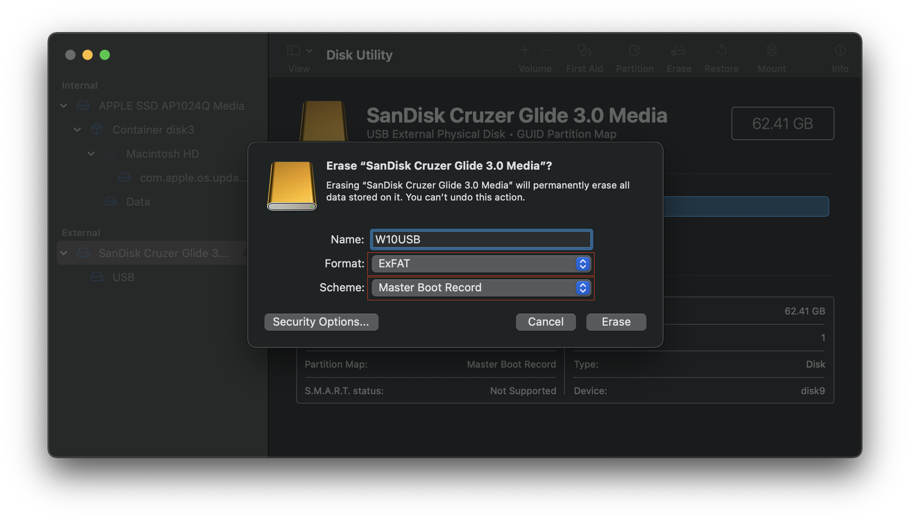
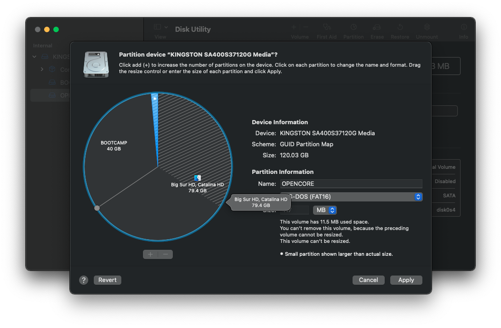
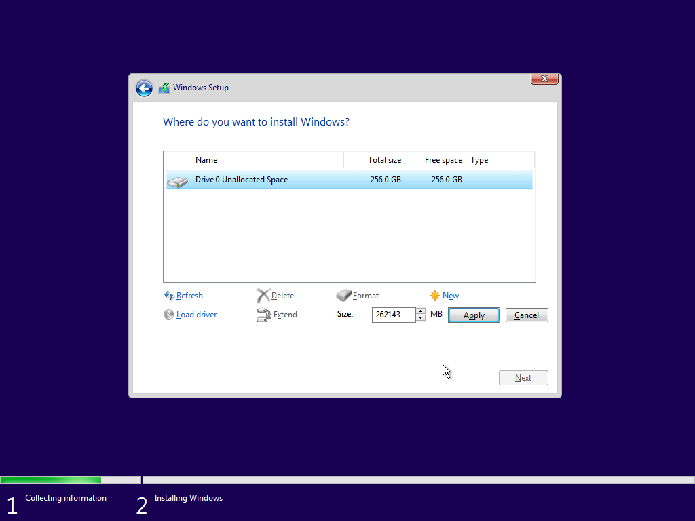
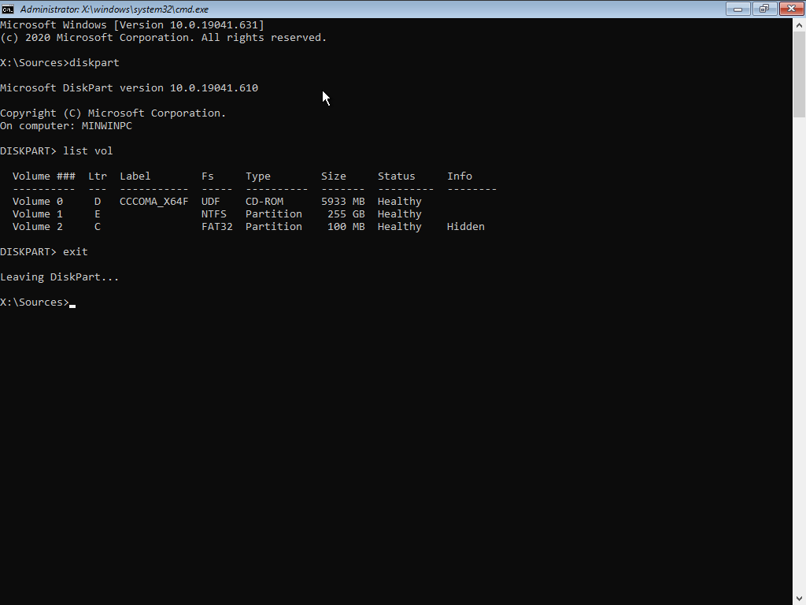
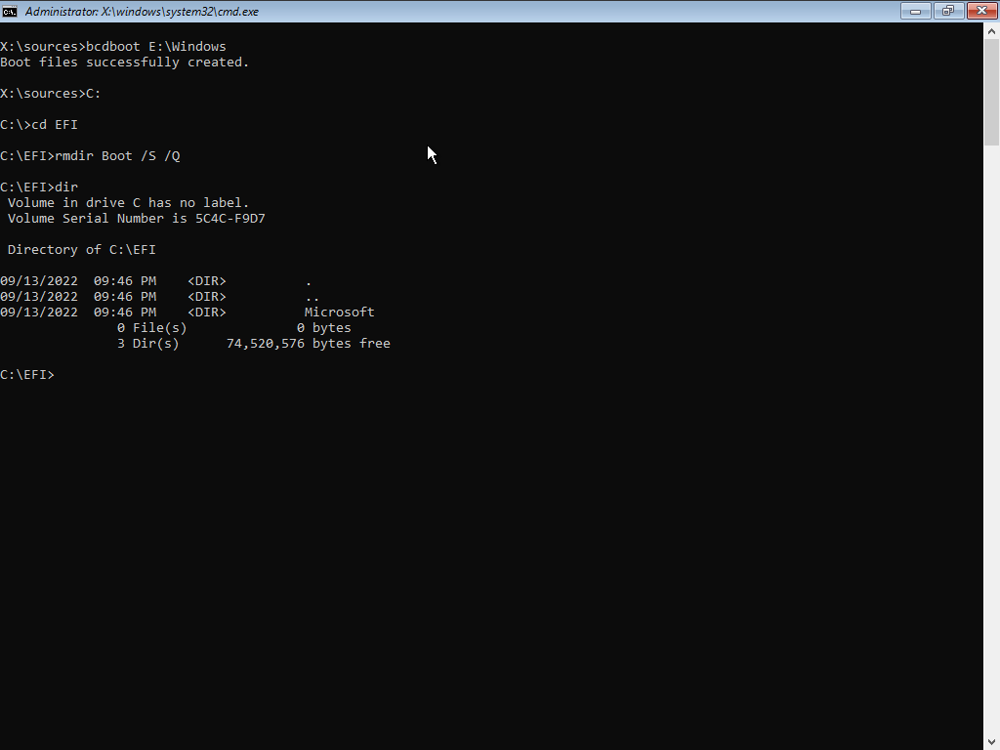
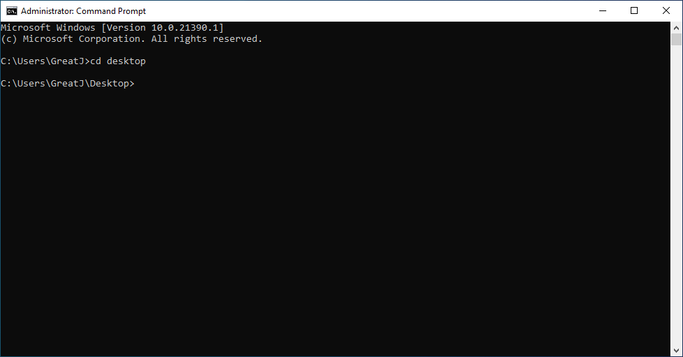
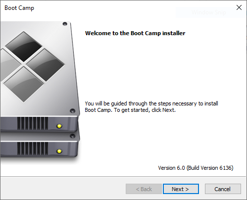

# Installing Windows in UEFI Mode

Modern versions of Windows officially support two types of firmware: UEFI and BIOS. Users may want to boot Windows through the OCLP Bootpicker, but only UEFI Installations of Windows will show up in the OCLP Bootpicker.
Many older Macs do not "officially" support UEFI Windows installations, leading to installation failures and strange behaviour, but OCLP can be used to prevent almost all of these issues.

## Minimum Requirements

This guide will focus on the installation of modern Windows (10/11) without using Boot Camp Assistant.

* Due to hardware and firmware limitations, UEFI Windows installations are only recommended on the following machines:

  * 2015 MacBook or newer (`MacBook8,x`+)
  * 2011 MacBook Air or newer (`MacBookAir4,x`+)
  * 2011 MacBook Pro or newer (`MacBookPro8,x`+)
  * 2011 Mac mini or newer (`Macmini5,x`+)
  * 2009* Mac Pro or newer (`MacPro4,1`+), upgraded GPU is preferred
  * 2010 iMac or newer (`iMac11,x`+), upgraded GPU is preferred
  * 2009* Xserve (`Xserve3,1`), upgraded GPU is preferred


*`MacPro4,1`, `MacPro5,1`, and `Xserve3,1` systems experience issues with the Windows installer, follow the DISM installation section for instructions.

If your machine is not listed, UEFI Windows will likely still install, but you may face stability/driver issues.

## Disk Partitioning and Formatting

The following is required for installation:
* 8GB+ USB Drive for the Windows installer
* 30GB+ Free Space on an existing drive / empty drive for the Windows installation

### Formatting the USB Drive

Open Disk Utility in macOS and format the USB Drive as ExFat with the Master Boot Record scheme:



### Formatting the Target Drive

Next, select the drive you wish to install Windows in Disk Utility on and partition it as ExFat (If formatting the entire drive, ensure it's using the GUID Partition Table scheme):


:::warning

Incorrectly erasing your drive can lead to data loss! Please verify that you are erasing the correct drive/partition.

:::

If you plan to use the same hard drive for macOS and Windows, we recommend creating a dedicated partition just for OpenCore. This lets Windows have the ESP to itself and OpenCore can stay within it's own bubble.

Recommended size is 200MB and the partition format **must** be FAT32 for OpenCore to operate correctly. You will next want to install OpenCore onto the new partition, either moving from the ESP with [MountEFI](https://github.com/corpnewt/MountEFI) or rerunning the OpenCore-Patcher.app

* Note 1: For machines with dedicated drives for Windows, having different partitions for OpenCore is not required.
* Note 2: Having different partitions for OpenCore is not required if the Windows boot files detected by the stock Bootpicker are removed. See "Removing the Windows option from the stock bootpicker" for further information.
* Note 3: We recommend uninstalling OpenCore from the ESP/EFI Partition when you create this new OpenCore partition to avoid confusion when selecting OpenCore builds in the Mac's boot picker.



## Creating the Windows Installer

The latest Windows installation images can be downloaded from Microsoft using the following links:

* [Download Windows 10 Disc Image (ISO File)](https://www.microsoft.com/en-ca/software-download/windows10ISO)

* [Download Windows 11 Disc Image (ISO File)](https://www.microsoft.com/en-ca/software-download/windows11)

Once the file is downloaded, mount the .iso image:


Then open terminal and use the `rsync` command with the disk image set as the source and your USB drive set as the target. (Replace "CCCOMA_X64" with the mounted image's partition name, and replace "InstallWin10" with your USB Drive's name).

```
rsync -r -P /Volumes/CCCOMA_X64/ /Volumes/InstallWin10
```


The `rsync` command will take some time, so get some coffee and sit back. Once finished, the root of the USB drive should look as follows:


* Ensure that these folders and files are in the root of the USB drive, otherwise the USB will not boot.


## Installation Process

Once you reboot your machine, you should see a new boot option in the OCLP Bootpicker labelled as "EFI Boot" or "Windows". It may or may not have the Boot Camp icon.

:::warning

If you aren't booted into OCLP, you may see **two** boot options labelled "Windows" and "EFI Boot". Do not choose either of the options and boot into OCLP to continue.

:::


### Installation: Microsoft Method

Once booted into the Windows installer, proceed as you normally would on any Windows computer. If you see an error message containing “Windows could not prepare the computer to boot into the next phase of installation”, please follow the next portion of this guide (DISM Installation).

::: details Installing Windows 11

If you are installing Windows 11, you will need to [modify the Windows Setup](https://www.bleepingcomputer.com/news/microsoft/how-to-bypass-the-windows-11-tpm-20-requirement/) to allow installation on unsupported machines.

:::

### Installation: DISM Deployment Method

Once booted into the Windows installer, proceed as you normally would until you reach the "Where do you want to install Windows" disk formatting section.

When you are prompted to select a drive, select your desired partition and delete it using "Delete". If you want to install Windows to an empty drive, erase every partition currently on the desired drive.
After your drive/partition is erased, press "New" to create the Windows system partitions.



You will be prompted to confirm the creation of the system partitions, press "OK".


Once the partitions are created, select the main (largest) partition and press "Format". This will format the partition using the NFTS file system.


After the installer formats the partition, open up the Command Prompt by pressing SHIFT + F10. Then run the `diskpart` command, and `list vol`. This will produce a list of volumes in your system, make sure to keep track of the drive letters of the main Windows partition (largest, NTFS), the EFI partition (100MB, FAT32), and the Windows installer (Usually Drive D). Run `exit` to close diskpart



Now, get a list of available Windows editions by running `dism /Get-WimInfo /WimFile:D:\Sources\install.wim` (substituting D with the Installer Drive Letter). This guide will use Option 6 for Windows 10 Pro.


You can now start the deployment process. Run `dism /Apply-Image /ImageFile:D:\Sources\install.wim /index:6 /ApplyDir:E:`, replacing "D" with the Installer Drive Letter, "6" with the Windows edition option, and "E" with the Windows Partition Drive Letter.


Once `dism` finishes its thing, run `bcdboot E:\Windows`, substituting "E" for the drive letter of the main Windows partition to create the boot files.


Windows is now installed. It should be recognized as "EFI Boot" or "Windows" with a Boot Camp icon in the OCLP Bootpicker.

:::warning

After the boot files are created, **DO NOT** reboot if you are using a MacPro4,1, MacPro5,1, or Xserve3,1 system! A bug in the Windows bootloader exists that will completely brick the system if it is loaded through the stock bootpicker. See the "Installation: Removing the Windows option from the stock bootpicker" section for a workaround.

:::

### Installation: Removing the Windows option from the stock bootpicker

Removing the Windows boot option from the stock bootpicker is **HIGHLY RECOMMENDED** on MacPro4,1, MacPro5,1, and Xserve3,1 systems in order to prevent Secure Boot NVRAM corruption and bricking.

Start up a command prompt window in the Windows Setup environment by running `cmd`.

Next, enter the EFI Folder by running `C:`, substituting "C" for the EFI Partition Drive Letter. Then run `cd EFI` to enter the EFI Partition. Then, run `rmdir Boot /S /Q` to remove the boot files that can be detected by the stock Bootpicker. The OCLP Picker will still be able to detect and boot Windows.


You can verify that the `Boot` folder is removed by running the `dir` command:



If, for whatever reason, you are not able to remove the boot files from the Windows setup, shut down your system, boot into macOS, mount your EFI partition with [MountEFI](https://github.com/corpnewt/MountEFI), and remove the `Boot` folder (it should have a recent file modification date, and contain `Bootx64.efi`).


## Post-Installation

### Installing Boot Camp Software

To get started, download the Brigadier utility from the following link:

* [Download Brigadier](https://github.com/timsutton/brigadier/releases/download/0.2.4/brigadier.exe)

Once Brigadier is downloaded, move it to your desktop for easy access.

Open up a command prompt window as a standard user and run `cd desktop`.



Then run `.\brigadier.exe --model=MODEL1,1`, replacing "MODEL1,1" with your machine's SMBIOS model.


Once the Boot Camp software is downloaded, you can install it by executing `Setup.exe` or `\Drivers\Apple\BootCamp.msi` (`BootCamp64.msi` if present).

### Installing Boot Camp 6 softare on unsupported machines

To get started, download the Brigadier utility from the following link:

* [Download Brigadier](https://github.com/timsutton/brigadier/releases/download/0.2.4/brigadier.exe)

Once Brigadier is downloaded, move it to your desktop for easy access.

Open up a command prompt window as a standard user and run `cd desktop`.


Then run `.\brigadier.exe --model=MacPro7,1`. This will download the latest BootCamp 6 package.


Once the Boot Camp software is downloaded, you can install Boot Camp 6 by executing `\Drivers\Apple\BootCamp.msi` in an administrator command prompt window.

## Troubleshooting

### "This version of Boot Camp is not intended for this computer model."

If you built OpenCore with Moderate or higher SMBIOS spoofing, you'll get an error when trying to install Boot Camp drivers. You can solve this by either rebuilding OpenCore with a lower spoof level, or running the installer from `Drivers/Apple/BootCamp.msi`.

| Setup.exe | BootCamp.msi |
| :--- | :--- |
|  |  |

::: details BootCamp.msi quirks

If needed, you can run it from the command line as administrator:

```
set __COMPAT_LAYER=WIN7RTM && start \path\to\BootCamp\Drivers\Apple\Bootcamp.msi'
```

Make sure to substitute `\path\to` with the location of the Boot Camp folder.

You can also open `Properties` on the file to change the compatibility to `Previous version of Windows` in case you have Boot Camp 4.0 drivers (the above command does this already.)

:::

### iMac12,x Bluescreen after driver installation

Intel's iGPU drivers for the HD 3000 series do not support UEFI booting in Windows. The recommended solution is to simply disable the iGPU: [iMac 12,1 Windows 10 Boot Loop – Fix Intel Graphics issue](https://zzq.org/?p=39)

### NVIDIA Tesla Black Screen after driver installation

The NVIDIA Tesla GPUs found in 2008-2010 Macs do not support UEFI booting in Windows. You cannot use UEFI Windows without low-level patching on these machines.